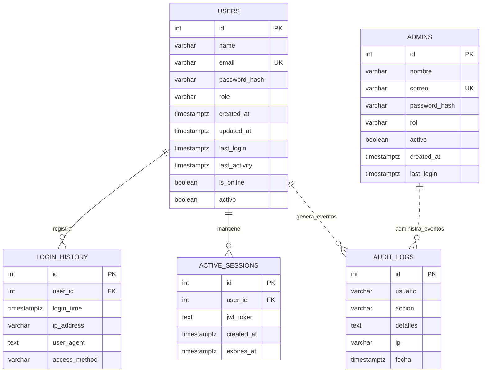

UNIVERSIDAD PRIVADA DE TACNA

FACULTAD DE INGENIERIA

Escuela Profesional de Ingenieria de Sistemas

Proyecto Validador de Sintaxis SQL/NoSQL

Curso: Base de Datos II

Docente: Patrick Jose Cuadros Quiroga

Integrantes:

Arocutipa Arocutipa, Gian Franco (2023076790)

Soto Oquendo Cristian Gabriel (2026086510)

Tacna - Peru

2026

# Validador de Sintaxis SQL/NoSQL

# Diccionario de Datos

Version 1.0

## INDICE GENERAL

1. Diccionario de Datos
2. Modelo Entidad / Relacion
3. Diseno Fisico
4. Tablas
5. Relaciones de las tablas
6. Reglas y consideraciones de datos

## Diccionario de Datos

El presente documento describe el diccionario de datos del sistema Validador de Sintaxis SQL/NoSQL. El sistema utiliza PostgreSQL como base de datos transaccional para gestionar usuarios, administradores, sesiones activas, historial de accesos y auditoria de eventos de autenticacion, administracion y validacion.

La fuente principal para este diccionario es el archivo `src/database/schema.sql`, complementado con el uso de las tablas en los controladores `auth.controller.js`, `admin.controller.js`, `validation.controller.js`, el middleware de actividad y la configuracion de inicializacion de base de datos.

## Modelo Entidad / Relacion

## Diseno Fisico

Motor de base de datos: PostgreSQL.

Archivo de definicion: `src/database/schema.sql`.

Inicializacion: `src/config/db.config.js` ejecuta el esquema al iniciar la aplicacion y crea un administrador inicial cuando existen las variables `ADMIN_EMAIL` y `ADMIN_PASSWORD`.

Tablas fisicas:

- `users`
- `login_history`
- `active_sessions`
- `admins`
- `audit_logs`

## DICCIONARIO DE DATOS

## Tablas

### TABLA: USERS

Descripcion: almacena las cuentas de usuarios normales que utilizan la interfaz web del validador.

| Nro | Campo | Tipo | Longitud | Nulos | PK | FK | Descripcion |
| --- | --- | --- | --- | --- | --- | --- | --- |
| 1 | id | SERIAL / INTEGER | - | No | Si | No | Identificador unico autoincremental del usuario. |
| 2 | name | VARCHAR | 255 | Si | No | No | Nombre visible del usuario registrado. |
| 3 | email | VARCHAR | 255 | No | No | No | Correo electronico unico para autenticacion. Restriccion UNIQUE. |
| 4 | password_hash | VARCHAR | 255 | Si | No | No | Hash de la contrasena generado con bcrypt. |
| 5 | role | VARCHAR | 50 | Si | No | No | Rol de usuario. Valor por defecto: `user`. |
| 6 | created_at | TIMESTAMP WITH TIME ZONE | - | Si | No | No | Fecha y hora de creacion del registro. Valor por defecto: `CURRENT_TIMESTAMP`. |
| 7 | updated_at | TIMESTAMP WITH TIME ZONE | - | Si | No | No | Fecha y hora de ultima actualizacion del registro. Valor por defecto: `CURRENT_TIMESTAMP`. |
| 8 | last_login | TIMESTAMP WITH TIME ZONE | - | Si | No | No | Ultima fecha y hora de inicio de sesion exitoso. |
| 9 | last_activity | TIMESTAMP WITH TIME ZONE | - | Si | No | No | Ultima actividad detectada por el middleware de actividad. |
| 10 | is_online | BOOLEAN | - | Si | No | No | Indica si el usuario se encuentra activo/en linea. Valor por defecto: `false`. |
| 11 | activo | BOOLEAN | - | Si | No | No | Indica si la cuenta esta habilitada. Valor por defecto: `true`. |

### TABLA: LOGIN_HISTORY

Descripcion: registra los accesos exitosos de usuarios normales al sistema.

| Nro | Campo | Tipo | Longitud | Nulos | PK | FK | Descripcion |
| --- | --- | --- | --- | --- | --- | --- | --- |
| 1 | id | SERIAL / INTEGER | - | No | Si | No | Identificador unico autoincremental del acceso. |
| 2 | user_id | INTEGER | - | Si | No | Si | Usuario asociado al inicio de sesion. Referencia `users(id)` con `ON DELETE CASCADE`. |
| 3 | login_time | TIMESTAMP WITH TIME ZONE | - | Si | No | No | Fecha y hora del inicio de sesion. Valor por defecto: `CURRENT_TIMESTAMP`. |
| 4 | ip_address | VARCHAR | 45 | Si | No | No | Direccion IP desde la que se inicio sesion. Soporta IPv4 e IPv6. |
| 5 | user_agent | TEXT | - | Si | No | No | Cadena User-Agent del navegador o cliente HTTP. |
| 6 | access_method | VARCHAR | 50 | Si | No | No | Metodo de acceso. Valor por defecto: `local`. |

### TABLA: ACTIVE_SESSIONS

Descripcion: almacena tokens JWT activos de usuarios normales y su fecha de expiracion.

| Nro | Campo | Tipo | Longitud | Nulos | PK | FK | Descripcion |
| --- | --- | --- | --- | --- | --- | --- | --- |
| 1 | id | SERIAL / INTEGER | - | No | Si | No | Identificador unico autoincremental de la sesion. |
| 2 | user_id | INTEGER | - | Si | No | Si | Usuario propietario de la sesion. Referencia `users(id)` con `ON DELETE CASCADE`. |
| 3 | jwt_token | TEXT | - | No | No | No | Token JWT emitido al registrar o iniciar sesion. |
| 4 | created_at | TIMESTAMP WITH TIME ZONE | - | Si | No | No | Fecha y hora de creacion de la sesion. Valor por defecto: `CURRENT_TIMESTAMP`. |
| 5 | expires_at | TIMESTAMP WITH TIME ZONE | - | No | No | No | Fecha y hora de expiracion del token. En el controlador se calcula a 24 horas. |

### TABLA: ADMINS

Descripcion: almacena las cuentas administrativas utilizadas para gestionar usuarios, administradores, estadisticas y auditoria.

| Nro | Campo | Tipo | Longitud | Nulos | PK | FK | Descripcion |
| --- | --- | --- | --- | --- | --- | --- | --- |
| 1 | id | SERIAL / INTEGER | - | No | Si | No | Identificador unico autoincremental del administrador. |
| 2 | nombre | VARCHAR | 255 | No | No | No | Nombre visible del administrador. |
| 3 | correo | VARCHAR | 255 | No | No | No | Correo unico para autenticacion administrativa. Restriccion UNIQUE. |
| 4 | password_hash | VARCHAR | 255 | No | No | No | Hash de la contrasena administrativa generado con bcrypt. |
| 5 | rol | VARCHAR | 50 | Si | No | No | Rol administrativo. Valores usados por la aplicacion: `admin`, `superadmin`. Valor por defecto: `admin`. |
| 6 | activo | BOOLEAN | - | Si | No | No | Indica si la cuenta administrativa esta habilitada. Valor por defecto: `true`. |
| 7 | created_at | TIMESTAMP WITH TIME ZONE | - | Si | No | No | Fecha y hora de creacion del administrador. Valor por defecto: `CURRENT_TIMESTAMP`. |
| 8 | last_login | TIMESTAMP WITH TIME ZONE | - | Si | No | No | Ultimo inicio de sesion administrativo exitoso. |

### TABLA: AUDIT_LOGS

Descripcion: registra eventos relevantes del sistema, incluyendo autenticacion, administracion, validaciones SQL/NoSQL y cierre de sesion.

| Nro | Campo | Tipo | Longitud | Nulos | PK | FK | Descripcion |
| --- | --- | --- | --- | --- | --- | --- | --- |
| 1 | id | SERIAL / INTEGER | - | No | Si | No | Identificador unico autoincremental del evento de auditoria. |
| 2 | usuario | VARCHAR | 255 | Si | No | No | Correo o identificador del usuario/administrador que ejecuta la accion. |
| 3 | accion | VARCHAR | 100 | No | No | No | Tipo de accion registrada. Ejemplos: `REGISTER`, `LOGIN`, `ADMIN_LOGIN`, `LOGOUT`, `VALIDATION`, `CREATE_ADMIN`, `DEACTIVATE_USER`. |
| 4 | detalles | TEXT | - | Si | No | No | Descripcion libre del evento o resultado de la accion. |
| 5 | ip | VARCHAR | 45 | Si | No | No | Direccion IP origen del evento. Soporta IPv4 e IPv6. |
| 6 | fecha | TIMESTAMP WITH TIME ZONE | - | Si | No | No | Fecha y hora de registro del evento. Valor por defecto: `CURRENT_TIMESTAMP`. |

## Relaciones de las tablas

- `users` -> `login_history`: relacion uno a muchos mediante `login_history.user_id`. Al eliminar un usuario, se eliminan sus accesos por `ON DELETE CASCADE`.
- `users` -> `active_sessions`: relacion uno a muchos mediante `active_sessions.user_id`. Al eliminar un usuario, se eliminan sus sesiones por `ON DELETE CASCADE`.
- `users` -> `audit_logs`: relacion logica por correo/identificador en `audit_logs.usuario`. No existe clave foranea fisica porque el campo puede almacenar usuarios, administradores o eventos del sistema.
- `admins` -> `audit_logs`: relacion logica por correo administrativo en `audit_logs.usuario`. No existe clave foranea fisica por la misma razon anterior.
- `admins`: tabla independiente a nivel fisico. Su relacion con usuarios normales se da por operaciones administrativas registradas en auditoria.

## Reglas y consideraciones de datos

### Reglas de integridad

- `users.email` debe ser unico y no nulo.
- `admins.correo` debe ser unico y no nulo.
- `active_sessions.jwt_token` y `active_sessions.expires_at` no permiten nulos.
- `audit_logs.accion` no permite nulos.
- `login_history.user_id` y `active_sessions.user_id` referencian `users(id)` y usan eliminacion en cascada.

### Reglas funcionales observadas en el codigo

| Regla | Tabla(s) involucrada(s) | Descripcion |
| --- | --- | --- |
| Registro de usuario | `users`, `active_sessions`, `audit_logs` | Al registrar un usuario se crea la cuenta, se emite un JWT, se registra la sesion activa y se audita la accion `REGISTER`. |
| Inicio de sesion de usuario | `users`, `login_history`, `active_sessions`, `audit_logs` | Al iniciar sesion se actualizan `last_login`, `last_activity`, `is_online`, se registra el acceso y se audita `LOGIN`. |
| Inicio de sesion administrativo | `admins`, `audit_logs` | Al iniciar sesion como administrador se actualiza `last_login` y se audita `ADMIN_LOGIN`. |
| Cierre de sesion | `active_sessions`, `users`, `audit_logs` | Al cerrar sesion se elimina el token activo, se marca al usuario como desconectado y se audita `LOGOUT`. |
| Validacion SQL/NoSQL | `audit_logs` | Si existe usuario autenticado, cada validacion registra `VALIDATION` con dialecto y resultado exitoso/fallido. |
| Administracion de usuarios | `users`, `active_sessions`, `audit_logs` | Desactivar usuario actualiza `activo=false` y elimina sesiones activas. Eliminar usuario borra el registro y sus relaciones en cascada. |
| Administracion de administradores | `admins`, `audit_logs` | Crear, desactivar, reactivar, eliminar o cambiar rol de administradores se registra en auditoria. |
| Superadministrador minimo | `admins` | El codigo evita desactivar o degradar el ultimo `superadmin` activo. |

### Acciones principales de auditoria

| Accion | Origen | Descripcion |
| --- | --- | --- |
| REGISTER | `auth.controller.js` | Registro de usuario normal. |
| LOGIN | `auth.controller.js` | Inicio de sesion de usuario normal. |
| ADMIN_LOGIN | `auth.controller.js` | Inicio de sesion administrativo. |
| LOGOUT | `auth.controller.js` | Cierre de sesion. |
| VALIDATION | `validation.controller.js` | Validacion de consulta o archivo SQL/NoSQL. |
| CREATE_ADMIN | `admin.controller.js` | Creacion de administrador. |
| DEACTIVATE_ADMIN | `admin.controller.js` | Desactivacion de administrador. |
| REACTIVATE_ADMIN | `admin.controller.js` | Reactivacion de administrador. |
| DELETE_ADMIN | `admin.controller.js` | Eliminacion de administrador. |
| UPDATE_ADMIN_ROLE | `admin.controller.js` | Cambio de rol administrativo. |
| DEACTIVATE_USER | `admin.controller.js` | Desactivacion de usuario normal. |
| REACTIVATE_USER | `admin.controller.js` | Reactivacion de usuario normal. |
| DELETE_USER | `admin.controller.js` | Eliminacion de usuario normal. |

### Observaciones de diseno

- La base de datos no almacena las consultas SQL/NoSQL validadas; solo registra eventos de auditoria con el resultado general.
- El historial de consultas del usuario final se maneja en el navegador mediante `localStorage`, por lo que no existe una tabla fisica para historial de validaciones detalladas.
- Las sesiones activas se almacenan solo para usuarios normales. El login administrativo emite JWT, pero no inserta registros en `active_sessions`.
- La auditoria usa una relacion logica por correo en lugar de claves foraneas para conservar eventos aun si se elimina o desactiva una cuenta.
- El estado en linea de usuarios se calcula a partir de `last_activity` y se considera activo cuando la ultima actividad ocurrio dentro de los ultimos 5 minutos.
