UNIVERSIDAD PRIVADA DE TACNA

FACULTAD DE INGENIERÍA

Escuela Profesional de Ingeniería de Sistemas

Proyecto Syntax Validator

Curso: Base de Datos II

Docente: Patrick Jose Cuadros Quiroga

Integrantes:

Arocutipa Arocutipa, Gian Franco (2023076790)

Soto Oquendo Cristian Gabriel (2026086510)

Tacna – Perú

2026

| CONTROL DE VERSIONES |  |  |  |  |  |
| --- | --- | --- | --- | --- | --- |
| Versión | Hecha por | Revisada por | Aprobada por | Fecha | Motivo |
| 1.0 | G.A. / F.P. |  |  | 27/04/2026 | Versión Original |

# Syntax Validator

# Documento de Especificación de Requerimientos de Software

# Versión {1.0}

| CONTROL DE VERSIONES |  |  |  |  |  |
| --- | --- | --- | --- | --- | --- |
| Versión | Hecha por | Revisada por | Aprobada por | Fecha | Motivo |
| 1.0 | G.A. / C.S. |  |  | 27/04/2026 | Versión Original |

ÍNDICE GENERAL

# INTRODUCCIÓN

El presente documento describe la Especificacion de Requerimientos de Software (SRS) para el sistema SQL/NoSQL Syntax Validator, una aplicacion web orientada a la validacion de sintaxis de consultas SQL y MongoDB con deteccion de errores en tiempo real, sugerencias de correccion automatica y soporte para multiples dialectos.

El sistema propone una interfaz inspirada en entornos de desarrollo (VS Code-like) con editor Monaco integrado, que permite a desarrolladores y estudiantes validar consultas de base de datos sin necesidad de conectarse a un motor real. El validador soporta los dialectos MySQL, PostgreSQL, SQLite y ANSI para SQL, asi como comandos CRUD, de agregacion, administracion, sharding y replicacion para MongoDB.

El sistema se desarrolla con arquitectura MVC, utilizando Node.js con Express en el backend y JavaScript puro (ES6+) en el frontend, con Monaco Editor como componente central de la interfaz de usuario.

# Generalidades de la empresa

## Nombre de la empresa

SQL/NoSQL Syntax Validator — Herramienta Web de Validacion de Consultas de Base de Datos

## Visión

Ser la herramienta de referencia en validacion de sintaxis de consultas de base de datos para desarrolladores, estudiantes y arquitectos de datos en el ambito hispanoparlante, proporcionando retroalimentacion inmediata y precisa sin necesidad de un motor de base de datos real.

## Misión

Proveer a la comunidad de desarrolladores y estudiantes una herramienta web ligera, precisa e intuitiva para validar, depurar y aprender la sintaxis correcta de SQL y MongoDB, reduciendo el tiempo de deteccion de errores sintaticos en el ciclo de desarrollo de software.

## Organigrama

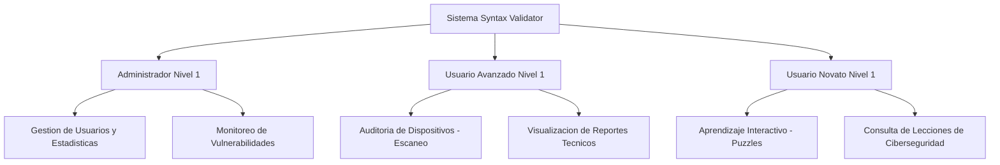
```mermaid
flowchart TD
  Sistema["Sistema Syntax Validator"]
  Admin["Administrador Nivel 1"]
  Avanzado["Usuario Avanzado Nivel 1"]
  Novato["Usuario Novato Nivel 1"]
  Gestion["Gestion de Usuarios y Estadisticas"]
  Monitoreo["Monitoreo de Vulnerabilidades"]
  Auditoria["Auditoria de Dispositivos - Escaneo"]
  Reportes["Visualizacion de Reportes Tecnicos"]
  Aprendizaje["Aprendizaje Interactivo - Puzzles"]
  Lecciones["Consulta de Lecciones de Ciberseguridad"]

  Sistema --> Admin
  Sistema --> Avanzado
  Sistema --> Novato
  Admin --> Gestion
  Admin --> Monitoreo
  Avanzado --> Auditoria
  Avanzado --> Reportes
  Novato --> Aprendizaje
  Novato --> Lecciones
```

# Visionamiento de la empresa

## Descripción de la empresa

Los desarrolladores y estudiantes de base de datos frecuentemente cometen errores de sintaxis al escribir consultas SQL o MongoDB que solo son descubiertos al ejecutar el codigo contra un motor real. Este proceso requiere configurar entornos de base de datos, crear esquemas de prueba y gestionar conexiones, lo que incrementa el tiempo de desarrollo y dificulta el aprendizaje.

El SQL/NoSQL Syntax Validator elimina esta friccion al ofrecer un validador en tiempo real directamente en el navegador, con indicacion precisa de la linea y columna del error, sugerencias de correccion y soporte para multiples dialectos en una unica herramienta.

## Objetivos de negocios

| N° | Objetivo | Indicador de Exito |
| --- | --- | --- |
| 1 | Validar consultas SQL con soporte multi-dialecto | Soporte de MySQL, PostgreSQL, SQLite y ANSI con deteccion correcta de al menos el 95% de errores sintatticos |
| 2 | Validar consultas MongoDB con deteccion semantica | Soporte de 20+ comandos y 10+ operadores con mensajes de error descriptivos |
| 3 | Proporcionar retroalimentacion precisa de errores | Errores reportados con numero de linea y columna exactos |
| 4 | Mantener historial de consultas del usuario | Historial persistente via localStorage con acceso rapido |
| 5 | Soportar carga de archivos .sql | Carga correcta de archivos .sql de hasta 1MB en el editor |

## Objetivos de diseño

| N° | Objetivo de Diseno |
| --- | --- |
| 1 | Arquitectura MVC con separacion clara: Modelo (validation.service.js), Vista (index.html + app.js + styles.css), Controlador (validation.controller.js) |
| 2 | Backend Node.js/Express con endpoints REST: POST /api/validate, GET /api/examples, GET /api/health |
| 3 | Frontend con Monaco Editor para resaltado de sintaxis, autocompletado y marcado de errores en linea |
| 4 | Soporte de temas claro y oscuro con persistencia de preferencia del usuario |
| 5 | Diseno responsivo compatible con resoluciones desde 768px |

## Alcance del proyecto

| Modulo | Descripcion | Tecnologia |
| --- | --- | --- |
| API REST de Validacion | Recibe consultas, las valida y retorna errores con posicion exacta | Node.js + Express |
| Validador SQL | Soporte para MySQL, PostgreSQL, SQLite y ANSI con node-sql-parser | node-sql-parser v4 |
| Validador MongoDB | Validacion de estructura JSON, comandos y operadores MongoDB | JSON.parse nativo + logica propia |
| Editor de Consultas | Editor Monaco integrado con resaltado, autocompletado y marcado de errores | Monaco Editor |
| Historial de Consultas | Persistencia local de validaciones anteriores para acceso rapido | localStorage |
| Carga de Archivos SQL | Importacion de archivos .sql desde el sistema de archivos local | File API del navegador |
| Tema Oscuro/Claro | Alternancia entre temas con persistencia de preferencia | CSS custom properties |

## Viabilidad del sistema

El sistema es viable tecnica, economica y operativamente:

- Tecnicamente: El equipo domina Node.js, Express, JavaScript ES6+ y el patron MVC. Las dependencias principales (node-sql-parser, Monaco Editor) son de codigo abierto y activamente mantenidas.

- Economicamente: No se requieren licencias de software. El despliegue puede realizarse en plataformas gratuitas como Vercel, Railway o Render para el backend, y Netlify para el frontend.

- Operativamente: Al ser una aplicacion web, no requiere instalacion en el cliente. El backend es stateless, lo que facilita el escalado horizontal.

## Información obtenida del Levantamiento de Información

| Tecnica | Fuente | Hallazgo Principal |
| --- | --- | --- |
| Analisis de herramientas existentes | SQLFiddle, DB Fiddle, MongoDB Playground | Requieren conexion a internet con BD real; no detectan errores sin ejecutar |
| Revision de parsers SQL | npm registry, GitHub | node-sql-parser es el parser mas completo y mantenido para Node.js con soporte multi-dialecto |
| Encuesta informal | Estudiantes de IS/CC | 70% prefiere validar sintaxis antes de ejecutar contra la BD de produccion |
| Analisis de Monaco Editor | Documentacion Microsoft | Monaco permite marcado de errores en linea con la API setModelMarkers, ideal para UX de validacion |

# Análisis de Procesos

## Diagrama del Proceso Actual - Diagrama de actividades

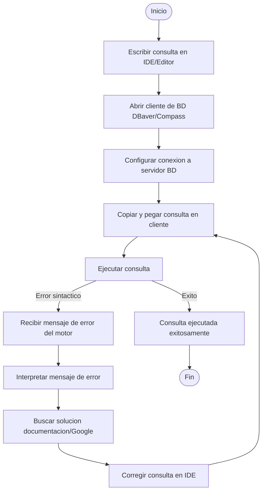
```mermaid
flowchart TD
  Inicio([Inicio])
  Escribir["Escribir consulta en IDE/Editor"]
  AbrirCliente["Abrir cliente de BD DBaver/Compass"]
  Configurar["Configurar conexion a servidor BD"]
  Copiar["Copiar y pegar consulta en cliente"]
  Ejecutar["Ejecutar consulta"]
  Error["Recibir mensaje de error del motor"]
  Interpretar["Interpretar mensaje de error"]
  Buscar["Buscar solucion documentacion/Google"]
  Corregir["Corregir consulta en IDE"]
  Exito["Consulta ejecutada exitosamente"]
  Fin([Fin])

  Inicio --> Escribir --> AbrirCliente --> Configurar --> Copiar --> Ejecutar
  Ejecutar -- "Error sintactico" --> Error --> Interpretar --> Buscar --> Corregir --> Copiar
  Ejecutar -- "Exito" --> Exito --> Fin
```

## Diagrama del Proceso Propuesto - Diagrama de actividades Inicial

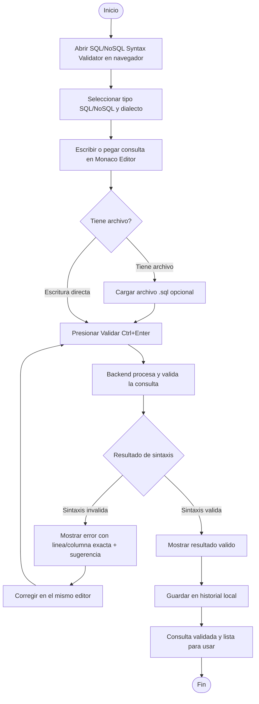
```mermaid
flowchart TD
  Inicio([Inicio])
  Abrir["Abrir SQL/NoSQL Syntax Validator en navegador"]
  Seleccionar["Seleccionar tipo SQL/NoSQL y dialecto"]
  Escribir["Escribir o pegar consulta en Monaco Editor"]
  Archivo{"Tiene archivo?"}
  Cargar["Cargar archivo .sql opcional"]
  Validar["Presionar Validar Ctrl+Enter"]
  Backend["Backend procesa y valida la consulta"]
  Resultado{"Resultado de sintaxis"}
  Error["Mostrar error con linea/columna exacta + sugerencia"]
  Corregir["Corregir en el mismo editor"]
  Valido["Mostrar resultado valido"]
  Historial["Guardar en historial local"]
  Lista["Consulta validada y lista para usar"]
  Fin([Fin])

  Inicio --> Abrir --> Seleccionar --> Escribir --> Archivo
  Archivo -- "Tiene archivo" --> Cargar --> Validar
  Archivo -- "Escritura directa" --> Validar
  Validar --> Backend --> Resultado
  Resultado -- "Sintaxis invalida" --> Error --> Corregir --> Validar
  Resultado -- "Sintaxis valida" --> Valido --> Historial --> Lista --> Fin
```

# Especificación de Requerimientos de Software

## Cuadro de Requerimientos funcionales Inicial

| ID | Modulo | Requerimiento Funcional | Prioridad |
| --- | --- | --- | --- |
| RF-01 | Validacion SQL | El sistema debe validar sintaxis SQL con soporte para MySQL, PostgreSQL, SQLite y ANSI | Alta |
| RF-02 | Validacion SQL | El sistema debe retornar la linea y columna exacta de cada error sintattico SQL | Alta |
| RF-03 | Validacion SQL | El sistema debe proveer sugerencias de correccion para errores SQL comunes | Media |
| RF-04 | Validacion NoSQL | El sistema debe validar estructura JSON valida en consultas MongoDB | Alta |
| RF-05 | Validacion NoSQL | El sistema debe validar comandos MongoDB soportados (find, insert, update, delete, aggregate, etc.) | Alta |
| RF-06 | Validacion NoSQL | El sistema debe validar operadores MongoDB ($in, $and, $or, $mod, $text, etc.) | Alta |
| RF-07 | Editor | El sistema debe ofrecer un editor Monaco con resaltado de sintaxis para SQL y JSON | Alta |
| RF-08 | Historial | El sistema debe guardar cada validacion en el historial local del usuario | Media |
| RF-09 | Archivos | El sistema debe permitir cargar archivos .sql para su validacion | Media |
| RF-10 | API | El sistema debe exponer endpoint POST /api/validate para validacion programatica | Alta |
| RF-11 | API | El sistema debe exponer endpoint GET /api/examples con consultas de ejemplo | Baja |
| RF-12 | API | El sistema debe exponer endpoint GET /api/health con estado del servidor | Baja |

## Cuadro de Requerimientos No funcionales

| ID | Categoria | Requerimiento No Funcional |
| --- | --- | --- |
| RNF-01 | Rendimiento | La validacion debe completarse en menos de 2 segundos para consultas de hasta 10,000 caracteres |
| RNF-02 | Disponibilidad | El backend debe tener disponibilidad del 99% en entorno de produccion |
| RNF-03 | Usabilidad | La interfaz debe ser intuitiva y no requerir manual de usuario para operaciones basicas |
| RNF-04 | Compatibilidad | El frontend debe funcionar en Chrome 90+, Firefox 88+, Safari 14+ y Edge 90+ |
| RNF-05 | Mantenibilidad | El codigo debe seguir el patron MVC con separacion clara de capas y cobertura de pruebas unitarias >= 80% |
| RNF-06 | Seguridad | El backend debe sanitizar todas las entradas para prevenir inyeccion de codigo malicioso |
| RNF-07 | Portabilidad | El backend debe ejecutarse en Node.js v18+ en Linux, macOS y Windows |
| RNF-08 | Escalabilidad | La arquitectura debe soportar al menos 100 peticiones/segundo sin degradacion de rendimiento |
| RNF-09 | Configurabilidad | El puerto del servidor debe ser configurable via variable de entorno PORT |

## Cuadro de Requerimientos funcionales Final

| ID | Caso de Uso | Actor | Descripcion Refinada | Prior. |
| --- | --- | --- | --- | --- |
| RF-01 | UC-01 | Usuario | Seleccionar tipo SQL, elegir dialecto (MySQL/PostgreSQL/SQLite/ANSI), presionar Validar. Sistema invoca POST /api/validate con {type:'sql', query, dialect}. | Alta |
| RF-02 | UC-01 | Sistema | Parser node-sql-parser procesa la consulta y retorna {valid, errors:[{line,column,message}], suggestions}. | Alta |
| RF-03 | UC-02 | Usuario | Seleccionar tipo NoSQL, ingresar JSON MongoDB, presionar Validar. Sistema invoca POST /api/validate con {type:'nosql', query}. | Alta |
| RF-04 | UC-02 | Sistema | Sistema valida estructura JSON, comando MongoDB y operadores. Retorna errores especificos por tipo. | Alta |
| RF-05 | UC-03 | Usuario | Presionar 'Subir Archivo', seleccionar .sql. Editor carga contenido y cambia a modo SQL automaticamente. | Media |
| RF-06 | UC-04 | Usuario | Cada validacion se guarda en localStorage. Boton 'Historial' muestra lista de consultas anteriores. | Media |
| RF-07 | UC-01/02 | Sistema | Monaco Editor marca errores en la posicion exacta (linea/columna) mediante setModelMarkers. | Alta |
| RF-08 | UC-05 | Usuario | GET /api/examples retorna consultas SQL y MongoDB de ejemplo clasificadas por tipo. | Baja |
| RF-09 | UC-06 | Usuario/Dev | GET /api/health retorna estado, timestamp, version y uptime del servidor. | Baja |

## Reglas de Negocio

| ID | Regla de Negocio | Descripcion |
| --- | --- | --- |
| RN-01 | Dialecto Obligatorio en SQL | Toda validacion SQL debe especificar un dialecto. El sistema usa MySQL como dialecto por defecto si no se especifica. |
| RN-02 | JSON Valido Previo | Toda consulta MongoDB debe ser JSON valido antes de validar comandos y operadores. Si el JSON es invalido, no se realizan validaciones semanticas. |
| RN-03 | Operadores Array | Los operadores $in, $nin, $all, $and, $or, $nor deben tener como valor un array. Si no es array, se reporta error semantico. |
| RN-04 | Operador $mod | El operador $mod debe tener exactamente 2 elementos en su array: [divisor, residuo]. |
| RN-05 | Operador $text | El operador $text debe ser un objeto que contenga la propiedad $search de tipo string. |
| RN-06 | Historial Local | El historial se almacena en localStorage del navegador. No se sincroniza entre dispositivos ni se envia al servidor. |
| RN-07 | Limite de Archivo | Solo se aceptan archivos con extension .sql para carga desde el sistema de archivos. |

# Fase de Desarrollo

## Perfiles de Usuario

| Perfil | Descripcion | Acceso al Sistema |
| --- | --- | --- |
| Desarrollador Backend | Profesional que escribe consultas SQL/MongoDB en su flujo de trabajo diario. Usa el validador para verificar sintaxis antes de ejecutar en produccion. | Editor, validacion SQL/NoSQL, historial, carga de archivos, API REST |
| Estudiante de BD | Estudiante de bases de datos que aprende SQL o MongoDB. Usa el validador para comprender errores y mejorar sus consultas con las sugerencias. | Editor, validacion SQL/NoSQL, historial, ejemplos precargados |
| Arquitecto de Datos | Profesional que disena esquemas y consultas complejas. Valida consultas multi-dialecto para garantizar portabilidad. | Editor multi-dialecto, API REST para integracion CI/CD |
| Sistema (API Consumer) | Aplicacion externa que consume la API REST del validador para integrar validacion en su propio flujo de CI/CD. | POST /api/validate, GET /api/health, GET /api/examples |

## Modelo Conceptual

### Diagrama de Paquetes

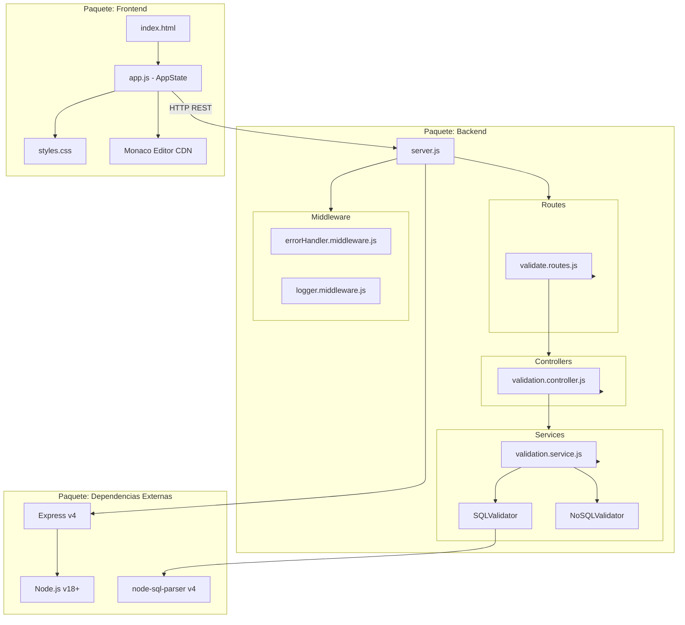
```mermaid
flowchart TB
  subgraph Backend["Paquete: Backend"]
    Server["server.js"]
    subgraph Routes["Routes"]
      ValidateRoutes["validate.routes.js"]
    end
    subgraph Middleware["Middleware"]
      ErrorHandler["errorHandler.middleware.js"]
      Logger["logger.middleware.js"]
    end
    subgraph Controllers["Controllers"]
      ValidationController["validation.controller.js"]
    end
    subgraph Services["Services"]
      ValidationService["validation.service.js"]
      SQLValidator["SQLValidator"]
      NoSQLValidator["NoSQLValidator"]
    end
  end

  subgraph Frontend["Paquete: Frontend"]
    Index["index.html"]
    App["app.js - AppState"]
    Styles["styles.css"]
    Monaco["Monaco Editor CDN"]
  end

  subgraph Externas["Paquete: Dependencias Externas"]
    Express["Express v4"]
    Node["Node.js v18+"]
    Parser["node-sql-parser v4"]
  end

  Index --> App
  App --> Styles
  App --> Monaco
  App -- "HTTP REST" --> Server
  Server --> Routes
  Server --> Middleware
  Routes --> ValidateRoutes --> Controllers
  Controllers --> ValidationController --> Services
  Services --> ValidationService
  ValidationService --> SQLValidator
  ValidationService --> NoSQLValidator
  Server --> Express --> Node
  SQLValidator --> Parser
```

### Diagrama de Casos de Uso

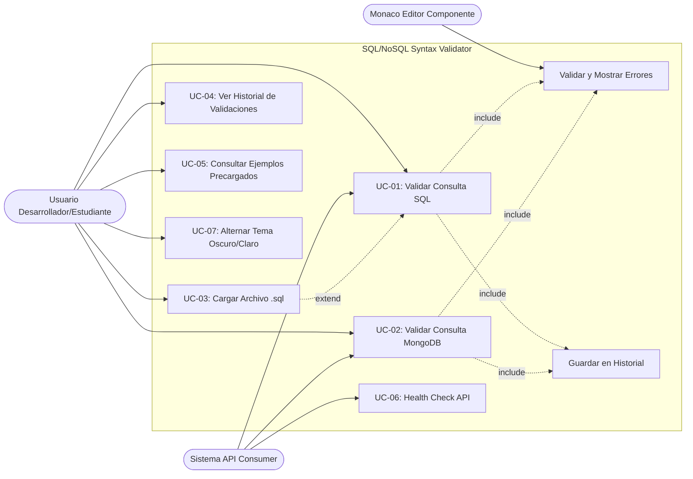
```mermaid
flowchart LR
  Usuario([Usuario Desarrollador/Estudiante])
  API([Sistema API Consumer])
  Editor([Monaco Editor Componente])

  subgraph Sistema["SQL/NoSQL Syntax Validator"]
    UC01["UC-01: Validar Consulta SQL"]
    UC02["UC-02: Validar Consulta MongoDB"]
    UC03["UC-03: Cargar Archivo .sql"]
    UC04["UC-04: Ver Historial de Validaciones"]
    UC05["UC-05: Consultar Ejemplos Precargados"]
    UC06["UC-06: Health Check API"]
    UC07["UC-07: Alternar Tema Oscuro/Claro"]
    Mostrar["Validar y Mostrar Errores"]
    Guardar["Guardar en Historial"]
  end

  Usuario --> UC01
  Usuario --> UC02
  Usuario --> UC03
  Usuario --> UC04
  Usuario --> UC05
  Usuario --> UC07
  API --> UC01
  API --> UC02
  API --> UC06
  Editor --> Mostrar
  UC03 -. "extend" .-> UC01
  UC01 -. "include" .-> Mostrar
  UC02 -. "include" .-> Mostrar
  UC01 -. "include" .-> Guardar
  UC02 -. "include" .-> Guardar
```

### Escenarios Casos de Uso

UC-01: Validar Consulta SQL

| ID | UC-01 |
| --- | --- |
| Nombre | Validar Consulta SQL |
| Actor Principal | Usuario (Desarrollador/Estudiante) |
| Precondicion | El usuario tiene acceso a la interfaz web del validador |
| Flujo Principal | 1. Usuario selecciona tipo 'SQL' en el selector de modo 2. Selecciona el dialecto: MySQL, PostgreSQL, SQLite o ANSI 3. Escribe o pega la consulta SQL en el editor Monaco 4. Presiona Ctrl+Enter o el boton 'Validar' 5. Sistema envia {type:'sql', query, dialect} al endpoint POST /api/validate 6. validation.service.js invoca node-sql-parser con el dialecto seleccionado 7. El parser retorna resultado {valid, errors, suggestions} 8. Sistema muestra resultado: indicador verde (valido) o rojo (error con posicion) |
| Flujo Alternativo | 3a. Usuario presiona 'Subir Archivo' y selecciona un .sql: el editor carga el contenido automaticamente 8a. Error de red: sistema muestra mensaje 'Error de conexion con el servidor de validacion' |
| Postcondicion | Resultado de validacion mostrado en pantalla y guardado en historial local |
| Prioridad | Alta |

UC-02: Validar Consulta MongoDB

| ID | UC-02 |
| --- | --- |
| Nombre | Validar Consulta MongoDB |
| Actor Principal | Usuario (Desarrollador/Estudiante) |
| Precondicion | El usuario tiene acceso a la interfaz web del validador |
| Flujo Principal | 1. Usuario selecciona tipo 'NoSQL' en el selector de modo 2. El editor cambia a modo JSON con resaltado apropiado 3. Usuario escribe la consulta MongoDB en formato JSON 4. Presiona Ctrl+Enter o el boton 'Validar' 5. Sistema envia {type:'nosql', query} al endpoint POST /api/validate 6. validation.service.js valida: (a) estructura JSON, (b) comando MongoDB, (c) operadores 7. Retorna {valid, errors:[{message}], suggestions} 8. Sistema muestra resultado con errores semanticos especificos |
| Flujo Alternativo | 6a. JSON invalido: sistema retorna error de parseo JSON sin continuar validacion semantica 6b. Comando no reconocido: sistema lista los comandos soportados en el mensaje de error |
| Postcondicion | Resultado de validacion mostrado y guardado en historial |
| Prioridad | Alta |

UC-03: Cargar Archivo SQL

| ID | UC-03 |
| --- | --- |
| Nombre | Cargar Archivo SQL |
| Actor Principal | Usuario |
| Precondicion | El usuario tiene un archivo .sql en su sistema de archivos |
| Flujo Principal | 1. Usuario presiona el boton 'Subir Archivo' en la barra lateral 2. Se abre el dialogo de seleccion de archivos del sistema operativo 3. Usuario selecciona un archivo con extension .sql 4. El contenido del archivo se carga en el editor Monaco 5. El modo del editor cambia automaticamente a SQL 6. El usuario puede proceder a validar la consulta cargada |
| Flujo Alternativo | 3a. Usuario selecciona archivo con extension diferente a .sql: sistema muestra advertencia 'Solo se aceptan archivos .sql' |
| Postcondicion | Contenido del archivo visible en el editor, listo para validacion |
| Prioridad | Media |

UC-04: Ver Historial de Validaciones

| ID | UC-04 |
| --- | --- |
| Nombre | Ver Historial de Validaciones |
| Actor Principal | Usuario |
| Precondicion | El usuario ha realizado al menos una validacion previa en el navegador |
| Flujo Principal | 1. Usuario presiona el boton 'Historial' en la barra lateral 2. Sistema recupera el historial desde localStorage 3. Se muestra la lista de validaciones anteriores con fecha, tipo y resultado 4. Usuario hace clic en un item del historial 5. La consulta asociada se carga en el editor para su reutilizacion |
| Flujo Alternativo | 2a. Historial vacio: sistema muestra mensaje 'No hay validaciones previas' |
| Postcondicion | Consulta historica cargada en el editor |
| Prioridad | Media |

UC-05: Consultar Ejemplos Precargados

| ID | UC-05 |
| --- | --- |
| Nombre | Consultar Ejemplos Precargados |
| Actor Principal | Usuario |
| Precondicion | El backend esta disponible |
| Flujo Principal | 1. Sistema carga automaticamente los ejemplos al iniciar la aplicacion via GET /api/examples 2. Usuario selecciona una consulta de ejemplo SQL o NoSQL del panel lateral 3. La consulta se carga en el editor con el modo correcto 4. Usuario puede validarla o modificarla |
| Flujo Alternativo | 1a. Backend no disponible: sistema muestra ejemplos predefinidos en el frontend |
| Postcondicion | Consulta de ejemplo cargada en el editor |
| Prioridad | Baja |

UC-06: Consultar Estado del Servidor (Health Check)

| ID | UC-06 |
| --- | --- |
| Nombre | Consultar Estado del Servidor |
| Actor Principal | Sistema / Desarrollador / Herramienta de Monitoreo |
| Precondicion | El backend esta en ejecucion |
| Flujo Principal | 1. Cliente envia GET /api/health 2. Sistema retorna JSON con {status:'ok', message, timestamp, environment, uptime} 3. Cliente verifica que el estado sea 'ok' para confirmar disponibilidad |
| Flujo Alternativo | 1a. Backend caido: cliente recibe error de conexion (timeout/connection refused) |
| Postcondicion | Cliente conoce el estado de salud del servicio |
| Prioridad | Baja |

## Modelo Lógico

### Análisis de Objetos

| Clase/Modulo | Atributos / Propiedades | Metodos / Funciones |
| --- | --- | --- |
| ValidationRequest | type: 'sql'\|'nosql', query: string, dialect?: string | validate() — punto de entrada de validacion |
| ValidationResponse | valid: boolean, dialect?: string, errors: ErrorDetail[], suggestions: string[] | toJSON() — serializacion de respuesta |
| ErrorDetail | line?: number, column?: number, message: string | format() — formatea el mensaje de error |
| SQLValidator | parser: SqlParser, dialect: string | validate(query, dialect): ValidationResponse |
| NoSQLValidator | supportedCommands: string[], arrayOperators: string[] | validate(query): ValidationResponse, validateOperators(obj): ErrorDetail[] |
| ValidationService | sqlValidator: SQLValidator, nosqlValidator: NoSQLValidator | validate(request): ValidationResponse |
| ValidationController | validationService: ValidationService | handleValidate(req, res), handleExamples(req, res), handleHealth(req, res) |
| AppState (Frontend) | currentMode: 'sql'\|'nosql', currentDialect: string, history: ValidationEntry[] | setMode(), setDialect(), addToHistory(), loadFromHistory() |
| MonacoWrapper (Frontend) | editor: monaco.editor.IStandaloneCodeEditor, markers: IMarkerData[] | initialize(), setLanguage(), setMarkers(errors), getValue() |

### Diagrama de Actividades con objetos

DA-UC01: Validar Consulta SQL

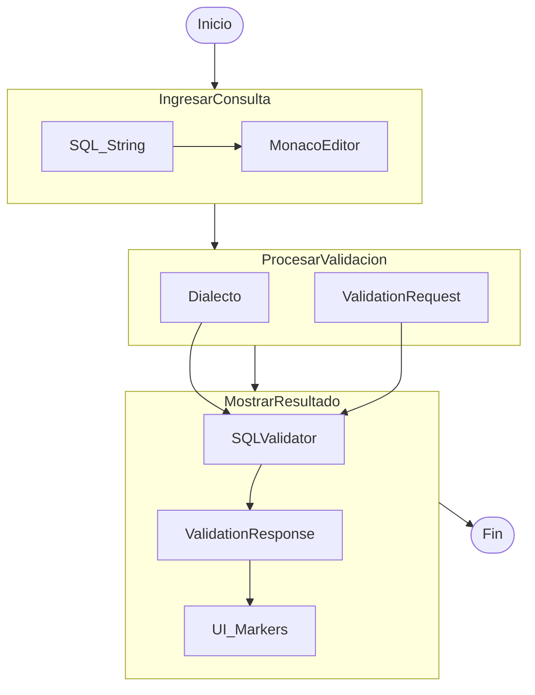
```mermaid
flowchart TD
  Inicio([Inicio])
  subgraph IngresarConsulta["IngresarConsulta"]
    SQLString["SQL_String"]
    MonacoEditor["MonacoEditor"]
    SQLString --> MonacoEditor
  end
  subgraph ProcesarValidacion["ProcesarValidacion"]
    Dialecto["Dialecto"]
    ValidationRequest["ValidationRequest"]
  end
  subgraph MostrarResultado["MostrarResultado"]
    SQLValidator["SQLValidator"]
    ValidationResponse["ValidationResponse"]
    UIMarkers["UI_Markers"]
    SQLValidator --> ValidationResponse --> UIMarkers
  end
  Fin([Fin])

  Inicio --> IngresarConsulta --> ProcesarValidacion
  Dialecto --> SQLValidator
  ValidationRequest --> SQLValidator
  ProcesarValidacion --> MostrarResultado --> Fin
```

UC-02: Validar Consulta MongoDB

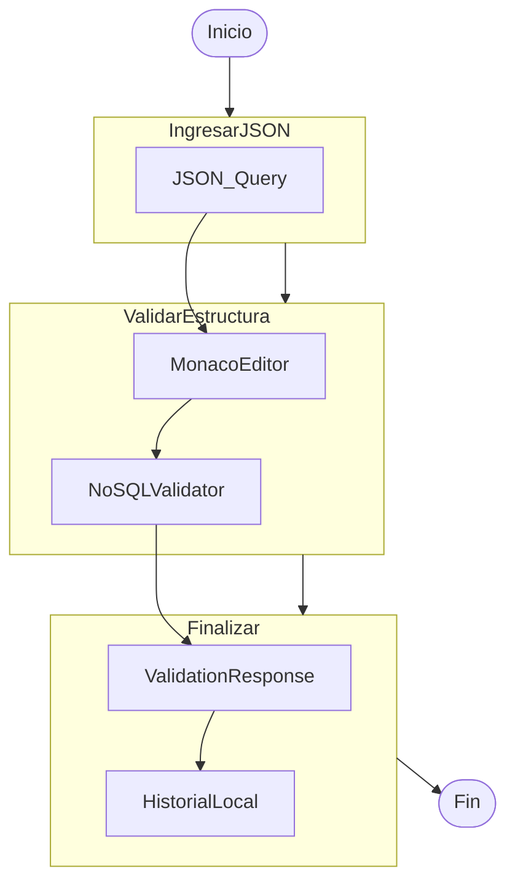
```mermaid
flowchart TD
  Inicio([Inicio])
  subgraph IngresarJSON["IngresarJSON"]
    JSONQuery["JSON_Query"]
  end
  subgraph ValidarEstructura["ValidarEstructura"]
    MonacoEditor["MonacoEditor"]
    NoSQLValidator["NoSQLValidator"]
    MonacoEditor --> NoSQLValidator
  end
  subgraph Finalizar["Finalizar"]
    ValidationResponse["ValidationResponse"]
    HistorialLocal["HistorialLocal"]
    ValidationResponse --> HistorialLocal
  end
  Fin([Fin])

  Inicio --> IngresarJSON --> ValidarEstructura --> Finalizar --> Fin
  JSONQuery --> MonacoEditor
  NoSQLValidator --> ValidationResponse
```

UC-03: Cargar Archivo SQL

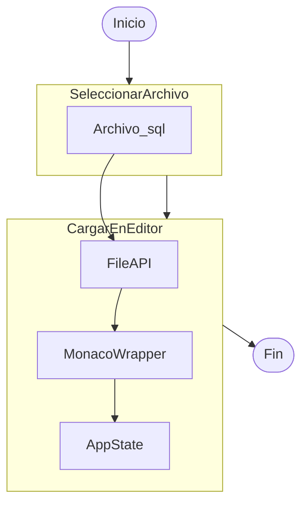
```mermaid
flowchart TD
  Inicio([Inicio])
  subgraph SeleccionarArchivo["SeleccionarArchivo"]
    Archivo["Archivo_sql"]
  end
  subgraph CargarEnEditor["CargarEnEditor"]
    FileAPI["FileAPI"]
    MonacoWrapper["MonacoWrapper"]
    AppState["AppState"]
    FileAPI --> MonacoWrapper --> AppState
  end
  Fin([Fin])

  Inicio --> SeleccionarArchivo --> CargarEnEditor --> Fin
  Archivo --> FileAPI
```

UC-04: Ver Historial de Validaciones

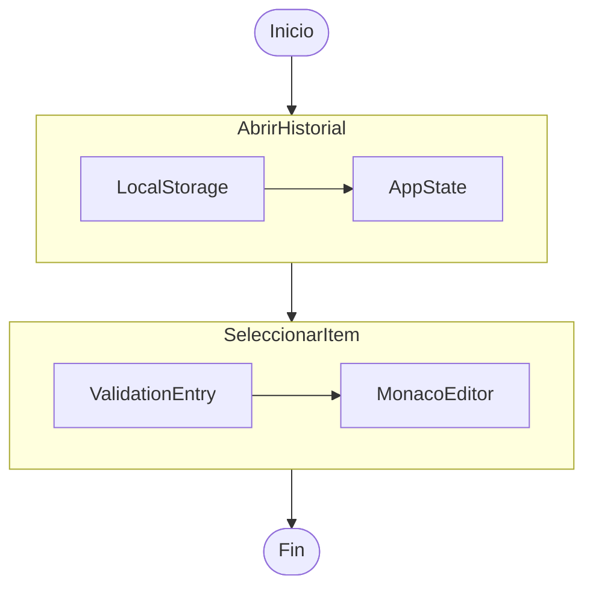
```mermaid
flowchart TD
  Inicio([Inicio])
  subgraph AbrirHistorial["AbrirHistorial"]
    LocalStorage["LocalStorage"]
    AppState["AppState"]
    LocalStorage --> AppState
  end
  subgraph SeleccionarItem["SeleccionarItem"]
    ValidationEntry["ValidationEntry"]
    MonacoEditor["MonacoEditor"]
    ValidationEntry --> MonacoEditor
  end
  Fin([Fin])

  Inicio --> AbrirHistorial --> SeleccionarItem --> Fin
```

UC-05: Consultar Ejemplos Precargados

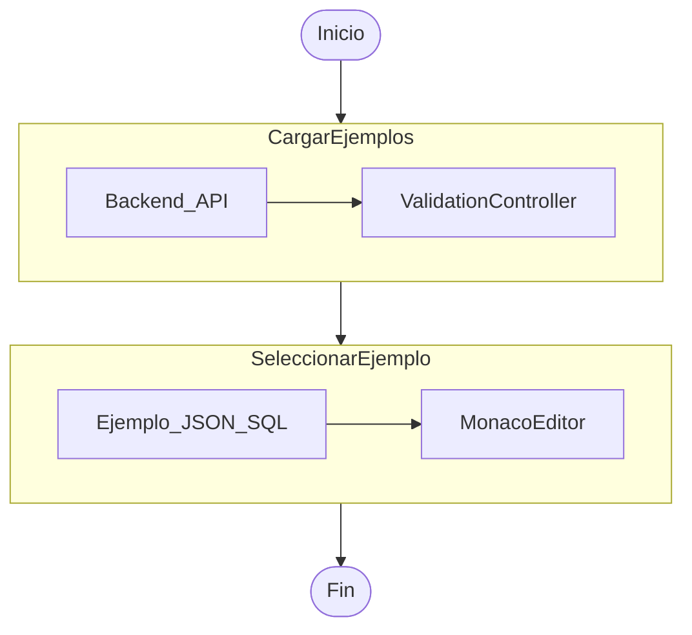
```mermaid
flowchart TD
  Inicio([Inicio])
  subgraph CargarEjemplos["CargarEjemplos"]
    BackendAPI["Backend_API"]
    ValidationController["ValidationController"]
    BackendAPI --> ValidationController
  end
  subgraph SeleccionarEjemplo["SeleccionarEjemplo"]
    Ejemplo["Ejemplo_JSON_SQL"]
    MonacoEditor["MonacoEditor"]
    Ejemplo --> MonacoEditor
  end
  Fin([Fin])

  Inicio --> CargarEjemplos --> SeleccionarEjemplo --> Fin
```

UC-06: Health Check API

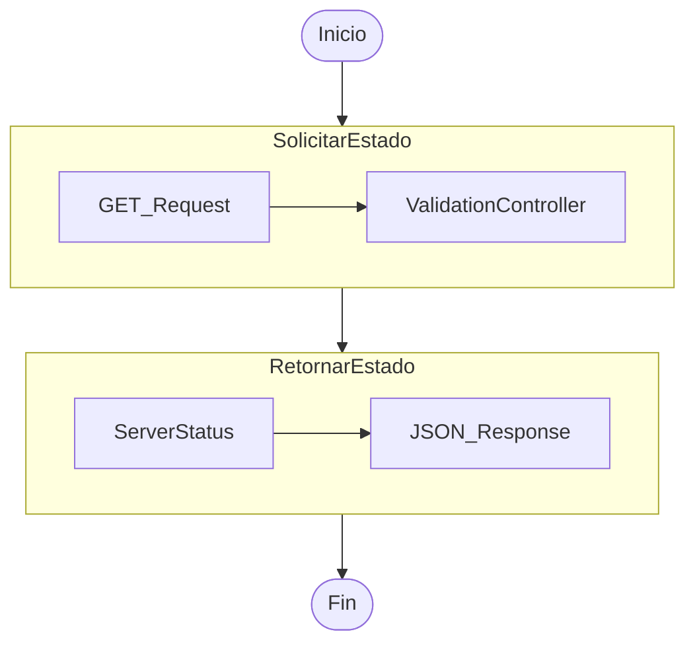
```mermaid
flowchart TD
  Inicio([Inicio])
  subgraph SolicitarEstado["SolicitarEstado"]
    GETRequest["GET_Request"]
    ValidationController["ValidationController"]
    GETRequest --> ValidationController
  end
  subgraph RetornarEstado["RetornarEstado"]
    ServerStatus["ServerStatus"]
    JSONResponse["JSON_Response"]
    ServerStatus --> JSONResponse
  end
  Fin([Fin])

  Inicio --> SolicitarEstado --> RetornarEstado --> Fin
```

### Diagrama de Secuencia

DS-UC01: Validar Consulta SQL

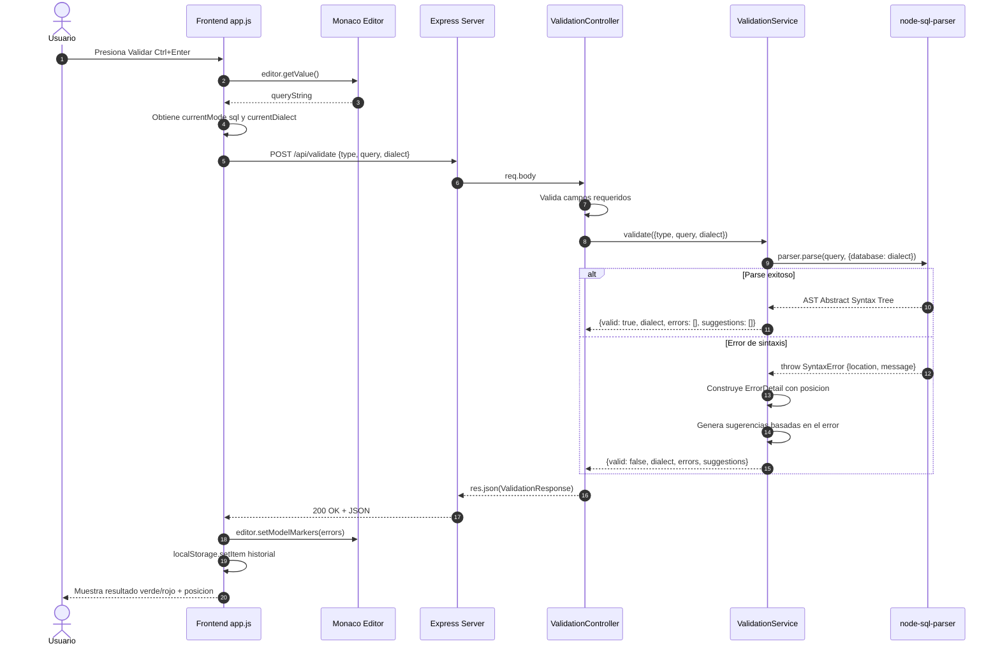
```mermaid
sequenceDiagram
  autonumber
  actor U as Usuario
  participant FE as Frontend app.js
  participant ME as Monaco Editor
  participant ES as Express Server
  participant VC as ValidationController
  participant VS as ValidationService
  participant Parser as node-sql-parser

  U->>FE: Presiona Validar Ctrl+Enter
  FE->>ME: editor.getValue()
  ME-->>FE: queryString
  FE->>FE: Obtiene currentMode sql y currentDialect
  FE->>ES: POST /api/validate {type, query, dialect}
  ES->>VC: req.body
  VC->>VC: Valida campos requeridos
  VC->>VS: validate({type, query, dialect})
  VS->>Parser: parser.parse(query, {database: dialect})
  alt Parse exitoso
    Parser-->>VS: AST Abstract Syntax Tree
    VS-->>VC: {valid: true, dialect, errors: [], suggestions: []}
  else Error de sintaxis
    Parser-->>VS: throw SyntaxError {location, message}
    VS->>VS: Construye ErrorDetail con posicion
    VS->>VS: Genera sugerencias basadas en el error
    VS-->>VC: {valid: false, dialect, errors, suggestions}
  end
  VC-->>ES: res.json(ValidationResponse)
  ES-->>FE: 200 OK + JSON
  FE->>ME: editor.setModelMarkers(errors)
  FE->>FE: localStorage.setItem historial
  FE-->>U: Muestra resultado verde/rojo + posicion
```

DS-UC02: Validar Consulta MongoDB

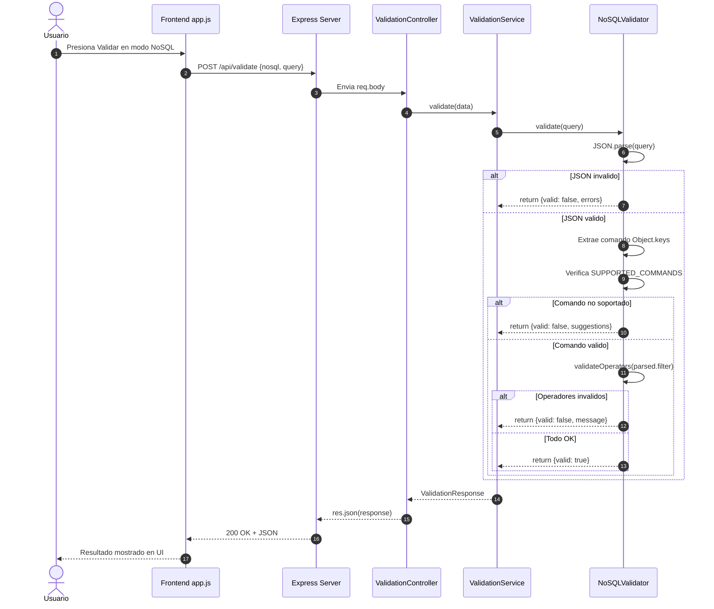
```mermaid
sequenceDiagram
  autonumber
  actor U as Usuario
  participant FE as Frontend app.js
  participant ES as Express Server
  participant VC as ValidationController
  participant VS as ValidationService
  participant NV as NoSQLValidator

  U->>FE: Presiona Validar en modo NoSQL
  FE->>ES: POST /api/validate {nosql, query}
  ES->>VC: Envia req.body
  VC->>VS: validate(data)
  VS->>NV: validate(query)
  NV->>NV: JSON.parse(query)
  alt JSON invalido
    NV-->>VS: return {valid: false, errors}
  else JSON valido
    NV->>NV: Extrae comando Object.keys
    NV->>NV: Verifica SUPPORTED_COMMANDS
    alt Comando no soportado
      NV-->>VS: return {valid: false, suggestions}
    else Comando valido
      NV->>NV: validateOperators(parsed.filter)
      alt Operadores invalidos
        NV-->>VS: return {valid: false, message}
      else Todo OK
        NV-->>VS: return {valid: true}
      end
    end
  end
  VS-->>VC: ValidationResponse
  VC-->>ES: res.json(response)
  ES-->>FE: 200 OK + JSON
  FE-->>U: Resultado mostrado en UI
```

DS-UC03: Cargar Archivo SQL

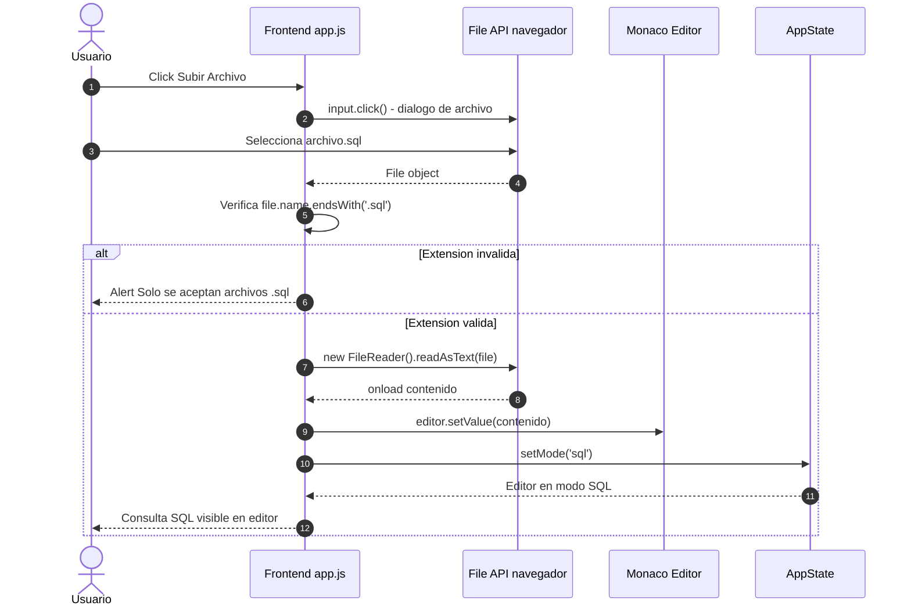
```mermaid
sequenceDiagram
  autonumber
  actor U as Usuario
  participant FE as Frontend app.js
  participant FileAPI as File API navegador
  participant ME as Monaco Editor
  participant State as AppState

  U->>FE: Click Subir Archivo
  FE->>FileAPI: input.click() - dialogo de archivo
  U->>FileAPI: Selecciona archivo.sql
  FileAPI-->>FE: File object
  FE->>FE: Verifica file.name.endsWith('.sql')
  alt Extension invalida
    FE-->>U: Alert Solo se aceptan archivos .sql
  else Extension valida
    FE->>FileAPI: new FileReader().readAsText(file)
    FileAPI-->>FE: onload contenido
    FE->>ME: editor.setValue(contenido)
    FE->>State: setMode('sql')
    State-->>FE: Editor en modo SQL
    FE-->>U: Consulta SQL visible en editor
  end
```

DS-UC04: Ver Historial

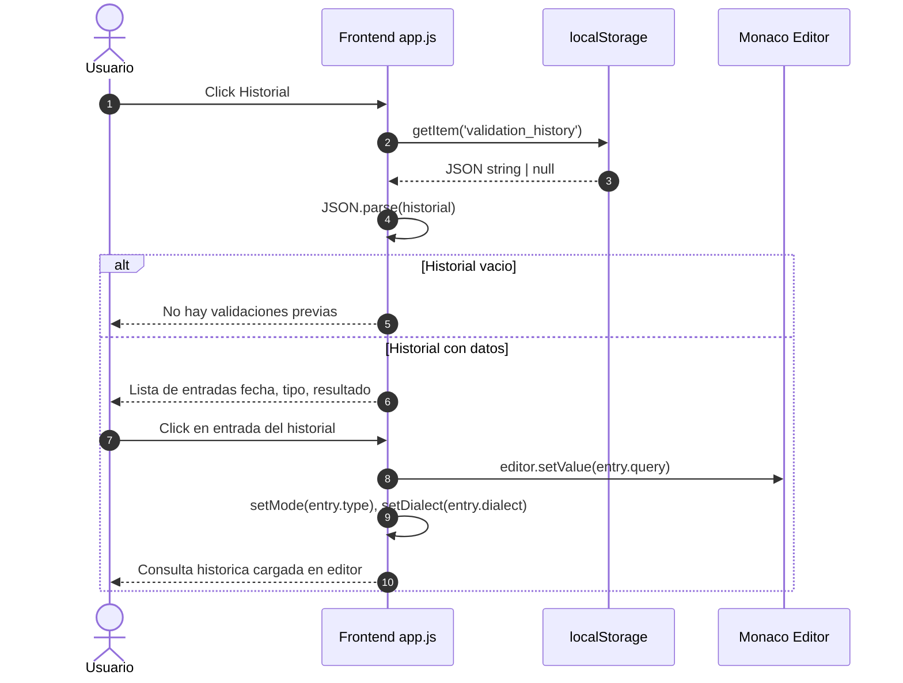
```mermaid
sequenceDiagram
  autonumber
  actor U as Usuario
  participant FE as Frontend app.js
  participant LS as localStorage
  participant ME as Monaco Editor

  U->>FE: Click Historial
  FE->>LS: getItem('validation_history')
  LS-->>FE: JSON string | null
  FE->>FE: JSON.parse(historial)
  alt Historial vacio
    FE-->>U: No hay validaciones previas
  else Historial con datos
    FE-->>U: Lista de entradas fecha, tipo, resultado
    U->>FE: Click en entrada del historial
    FE->>ME: editor.setValue(entry.query)
    FE->>FE: setMode(entry.type), setDialect(entry.dialect)
    FE-->>U: Consulta historica cargada en editor
  end
```

DS-UC05: Consultar Ejemplos

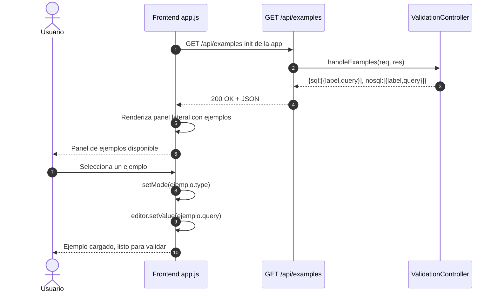
```mermaid
sequenceDiagram
  autonumber
  actor U as Usuario
  participant FE as Frontend app.js
  participant API as GET /api/examples
  participant VC as ValidationController

  FE->>API: GET /api/examples init de la app
  API->>VC: handleExamples(req, res)
  VC-->>API: {sql:[{label,query}], nosql:[{label,query}]}
  API-->>FE: 200 OK + JSON
  FE->>FE: Renderiza panel lateral con ejemplos
  FE-->>U: Panel de ejemplos disponible
  U->>FE: Selecciona un ejemplo
  FE->>FE: setMode(ejemplo.type)
  FE->>FE: editor.setValue(ejemplo.query)
  FE-->>U: Ejemplo cargado, listo para validar
```

DS-UC06: Health Check

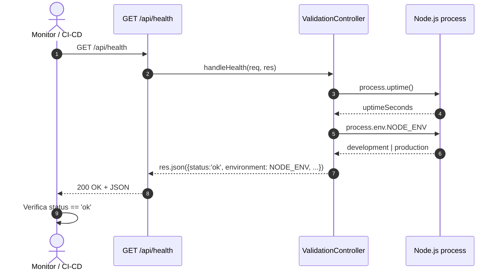
```mermaid
sequenceDiagram
  autonumber
  actor M as Monitor / CI-CD
  participant API as GET /api/health
  participant VC as ValidationController
  participant Node as Node.js process

  M->>API: GET /api/health
  API->>VC: handleHealth(req, res)
  VC->>Node: process.uptime()
  Node-->>VC: uptimeSeconds
  VC->>Node: process.env.NODE_ENV
  Node-->>VC: development | production
  VC-->>API: res.json({status:'ok', environment: NODE_ENV, ...})
  API-->>M: 200 OK + JSON
  M->>M: Verifica status == 'ok'
```

### Diagrama de Clases

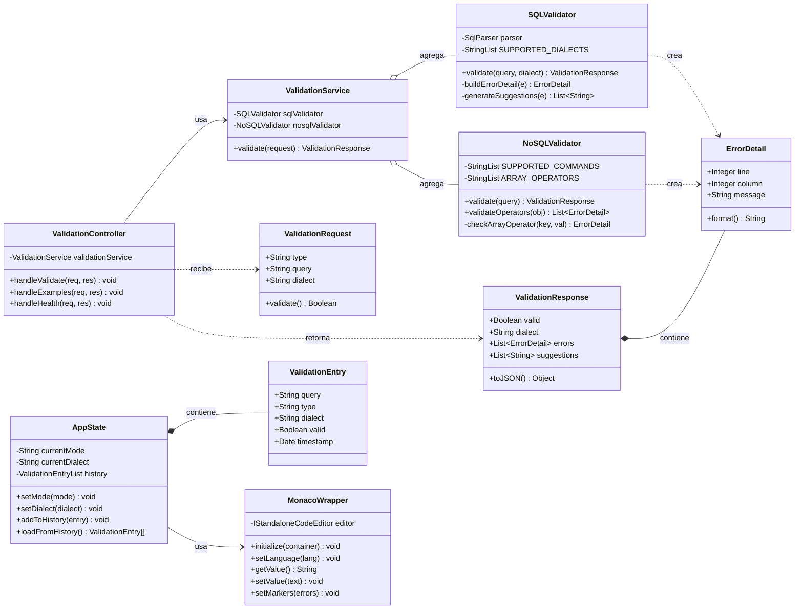
```mermaid
classDiagram
  direction LR

  class ValidationController {
    -ValidationService validationService
    +handleValidate(req, res) void
    +handleExamples(req, res) void
    +handleHealth(req, res) void
  }

  class ValidationService {
    -SQLValidator sqlValidator
    -NoSQLValidator nosqlValidator
    +validate(request) ValidationResponse
  }

  class ValidationRequest {
    +String type
    +String query
    +String dialect
    +validate() Boolean
  }

  class ValidationResponse {
    +Boolean valid
    +String dialect
    +List~ErrorDetail~ errors
    +List~String~ suggestions
    +toJSON() Object
  }

  class ErrorDetail {
    +Integer line
    +Integer column
    +String message
    +format() String
  }

  class SQLValidator {
    -SqlParser parser
    -StringList SUPPORTED_DIALECTS
    +validate(query, dialect) ValidationResponse
    -buildErrorDetail(e) ErrorDetail
    -generateSuggestions(e) List~String~
  }

  class NoSQLValidator {
    -StringList SUPPORTED_COMMANDS
    -StringList ARRAY_OPERATORS
    +validate(query) ValidationResponse
    +validateOperators(obj) List~ErrorDetail~
    -checkArrayOperator(key, val) ErrorDetail
  }

  class AppState {
    -String currentMode
    -String currentDialect
    -ValidationEntryList history
    +setMode(mode) void
    +setDialect(dialect) void
    +addToHistory(entry) void
    +loadFromHistory() ValidationEntry[]
  }

  class ValidationEntry {
    +String query
    +String type
    +String dialect
    +Boolean valid
    +Date timestamp
  }

  class MonacoWrapper {
    -IStandaloneCodeEditor editor
    +initialize(container) void
    +setLanguage(lang) void
    +getValue() String
    +setValue(text) void
    +setMarkers(errors) void
  }

  ValidationController --> ValidationService : usa
  ValidationController ..> ValidationRequest : recibe
  ValidationController ..> ValidationResponse : retorna
  ValidationService o-- SQLValidator : agrega
  ValidationService o-- NoSQLValidator : agrega
  SQLValidator ..> ErrorDetail : crea
  NoSQLValidator ..> ErrorDetail : crea
  ValidationResponse *-- ErrorDetail : contiene
  AppState *-- ValidationEntry : contiene
  AppState --> MonacoWrapper : usa
```

# CONCLUSIONES

- El SQL/NoSQL Syntax Validator proporciona una solucion efectiva para la validacion de sintaxis de consultas de base de datos sin necesidad de un motor real, reduciendo significativamente el ciclo de deteccion de errores en el desarrollo de software.

- La arquitectura MVC con Node.js/Express garantiza una separacion clara de responsabilidades que facilita el mantenimiento, las pruebas unitarias y la evolucion independiente de cada capa del sistema.

- El uso de Monaco Editor como componente central de la interfaz proporciona una experiencia de usuario profesional comparable a entornos de desarrollo integrados, con marcado de errores en linea y resaltado de sintaxis.

- El soporte multi-dialecto (MySQL, PostgreSQL, SQLite, ANSI) y multi-paradigma (SQL relacional y MongoDB NoSQL) en una unica herramienta diferencia al sistema de las soluciones existentes que suelen especializarse en un unico motor.

- La exposicion de una API REST permite la integracion del validador en pipelines de CI/CD y herramientas de desarrollo externas, ampliando su utilidad mas alla del uso interactivo.

# RECOMENDACIONES

- Implementar pruebas unitarias para validation.service.js con Jest, cubriendo al menos 50 escenarios de SQL valido/invalido por dialecto y 30 escenarios MongoDB, para garantizar la regresion del motor de validacion.

- Agregar soporte para SQL con multiples sentencias (batch validation) para cubrir el caso de uso de archivos .sql con transacciones completas.

- Considerar la implementacion de un worker de Node.js (worker_threads) para el procesamiento de consultas largas, evitando el bloqueo del event loop en archivos SQL de gran tamano.

- Evaluar la integracion de un linter de estilo SQL (similar a ESLint para JavaScript) que ademas de detectar errores sintatticos, sugiera mejores practicas de escritura de consultas.

- Documentar la API REST con OpenAPI/Swagger para facilitar la integracion por parte de consumidores externos del endpoint de validacion.

# BIBLIOGRAFÍA

- Google LLC. (2024). Android Developer Documentation — Security best practices. https://developer.android.com/privacy-and-security/security-tips

- C4 Model (2024). The C4 model for visualizing software architecture. Recuperado de: https://c4model.com/
