UNIVERSIDAD PRIVADA DE TACNA

FACULTAD DE INGENIERIA

Escuela Profesional de Ingeniería de Sistemas

Proyecto Validador de Sintaxis SQL u otra

Curso: Base de Datos II

Docente: Mag. Patrick Cuadros Quiroga

Integrantes:

Soto Oquendo Cristian Gabriel (2026086510)

Arocutipa Arocutipa Gian Franco (2023076790)

Tacna – Perú

2026

| CONTROL DE VERSIONES |  |  |  |  |  |
| --- | --- | --- | --- | --- | --- |
| Versión | Hecha por | Revisada por | Aprobada por | Fecha | Motivo |
| 1.0 | Soto/Arocutipa | Patrick Cuadros | Patrick Cuadros | 28/04/2026 | Versión Original |

# Sistema Validador de Sintaxis SQL u otra

# Documento de Arquitectura de Software

# Versión {1.0}

| CONTROL DE VERSIONES |  |  |  |  |  |
| --- | --- | --- | --- | --- | --- |
| Versión | Hecha por | Revisada por | Aprobada por | Fecha | Motivo |
| 1.0 | Soto/Arocutipa | Patrick Cuadros | Patrick Cuadros | 28/04/2026 | Versión Original |

INDICE GENERAL

1. INTRODUCCIÓN

1. Propósito (Diagrama 4+1)

El presente documento tiene como propósito describir de manera clara, estructurada y detallada la arquitectura del sistema denominado “Validador de Sintaxis SQL u otra”, utilizando como referencia el modelo arquitectónico 4+1. Este modelo permite representar la estructura del sistema desde diferentes perspectivas, facilitando su comprensión tanto a nivel técnico como conceptual.

La arquitectura del sistema se basa en un enfoque web moderno, implementado bajo el patrón Modelo-Vista-Controlador (MVC), el cual permite una adecuada separación de responsabilidades entre los distintos componentes del sistema. Esta organización contribuye a mejorar la mantenibilidad, escalabilidad y reutilización del código.

Desde el punto de vista funcional, el sistema ha sido diseñado para satisfacer necesidades específicas como la validación de consultas SQL en distintos dialectos y la verificación de estructuras NoSQL, particularmente en MongoDB. Asimismo, se busca proporcionar retroalimentación clara y precisa al usuario, indicando errores de sintaxis, ubicación y posibles soluciones.

En cuanto a los requisitos no funcionales, el sistema prioriza aspectos como la usabilidad, mediante una interfaz intuitiva basada en navegador; la portabilidad, permitiendo su ejecución en distintos dispositivos sin necesidad de instalación; y el rendimiento, garantizando tiempos de respuesta adecuados durante el proceso de validación.

Durante el diseño se tomaron decisiones importantes, como el uso de tecnologías web modernas (Node.js, Express y Monaco Editor), priorizando la facilidad de uso sobre la complejidad técnica. Asimismo, se optó por utilizar librerías especializadas para el análisis sintáctico, lo cual permite optimizar el tiempo de desarrollo y garantizar mayor precisión en los resultados.

En resumen, el propósito de este documento es presentar una visión integral del sistema, destacando cómo la arquitectura propuesta responde de manera eficiente a los requerimientos planteados y permite su evolución futura.

1. Alcance

El presente documento se centra en la descripción de la arquitectura del sistema, con énfasis en la vista lógica, la cual representa la estructura interna del software y la interacción entre sus componentes principales.

Se incluyen dentro del alcance los siguientes elementos:

| Elemento | Descripción |
| --- | --- |
| Frontend | Interfaz web con editor de código |
| Backend | Servidor encargado de validación |
| Servicios | Módulos de análisis SQL y NoSQL |
| API REST | Comunicación cliente-servidor |
| Flujo de datos | Proceso de validación |

Asimismo, se consideran aspectos de otras vistas del modelo 4+1:

| Vista | Descripción |
| --- | --- |
| Lógica | Organización interna del sistema |
| Desarrollo | Estructura del código |
| Física | Entorno de ejecución |
| Escenarios | Casos de uso principales |

No se incluye en detalle la vista de procesos, debido a que el sistema no presenta alta complejidad en concurrencia.

El sistema se limita a una versión inicial funcional, pero permite futuras extensiones:

| Posible Mejora | Descripción |
| --- | --- |
| Autenticación | Sistema de usuarios |
| Historial | Almacenamiento de consultas |
| Modo práctica | Ejercicios interactivos |
| Estadísticas | Análisis de uso |

1. Definición, siglas y abreviaturas

A continuación, se presentan los términos utilizados en el documento:

| Término | Definición |
| --- | --- |
| API | Interfaz para comunicación entre sistemas |
| AST | Representación estructural de una consulta |
| Backend | Lógica del sistema en servidor |
| Frontend | Interfaz visual del sistema |
| JSON | Formato de datos para NoSQL |
| MongoDB | Base de datos NoSQL |
| MVC | Patrón de arquitectura |
| Node.js | Entorno de ejecución backend |
| Parser | Analizador sintáctico |
| SQL | Lenguaje de bases de datos relacionales |
| NoSQL | Bases de datos no relacionales |
| Token | Unidad léxica |
| Monaco Editor | Editor de código web |
| REST | Arquitectura de servicios web |
| Endpoint | Punto de acceso a API |

1. Organización del documento

### 1.4.1. Organización Interna del Proyecto (Enfoque Técnico)

A nivel técnico, el proyecto sigue una arquitectura basada en el patrón Modelo-Vista-Controlador (MVC), lo que permite una adecuada separación de responsabilidades dentro del sistema.

| Capa | Componente | Descripción |
| --- | --- | --- |
| Vista (Frontend) | Interfaz Web | Permite al usuario ingresar consultas mediante Monaco Editor. |
| Controlador (Backend) | API REST | Gestiona las solicitudes HTTP y coordina la lógica del sistema. |
| Modelo (Servicios) | Validación SQL/NoSQL | Procesa y analiza las consultas ingresadas por el usuario. |

### 1.4.2. Estructura del Proyecto (Organización de Archivos)

El sistema se encuentra organizado en dos grandes módulos: frontend y backend, los cuales interactúan entre sí mediante una API REST.

| Módulo | Carpeta | Descripción |
| --- | --- | --- |
| Backend | services/ | Contiene la lógica de validación de consultas. |
|  | controllers/ | Maneja las solicitudes y respuestas HTTP. |
|  | routes/ | Define los endpoints de la API. |
|  | middleware/ | Manejo de errores y logging. |
|  | server.js | Punto de entrada del servidor. |
| Frontend | index.html | Interfaz principal del sistema. |
|  | app.js | Lógica de interacción del usuario. |
|  | styles.css | Estilos visuales. |

# OBJETIVOS Y RESTRICCIONES ARQUITECTONICAS

En esta sección se establecen las prioridades de los requerimientos del sistema, así como las principales restricciones que condicionan el diseño y desarrollo del proyecto Validador de Sintaxis SQL u otra.

La correcta priorización de los requerimientos permite definir un orden lógico de implementación, asegurando que las funcionalidades críticas del sistema sean desarrolladas en las primeras fases del proyecto. Asimismo, las restricciones establecen los límites dentro de los cuales debe operar el sistema, considerando aspectos técnicos, económicos y operativos.

1. Priorización de requerimientos

La priorización de requerimientos se ha realizado considerando criterios como:

- Impacto en el usuario

- Complejidad de implementación

- Dependencia entre funcionalidades

- Valor académico del sistema

Se ha utilizado una escala de prioridad:

- Alta (A): Funcionalidad crítica para el sistema

- Media (M): Funcionalidad importante pero no crítica

- Baja (B): Funcionalidad complementaria o futura

### Tabla General de Requerimientos

| ID | Descripción | Prioridad |
| --- | --- | --- |
| RF01 | Validación de consultas SQL | Alta |
| RF02 | Validación de consultas NoSQL | Alta |
| RF03 | Detección de errores con línea y columna | Alta |
| RF04 | Visualización de resultados en interfaz | Alta |
| RF05 | Selección de dialecto SQL | Media |
| RF06 | Carga de archivos (.sql/.json) | Media |
| RF07 | Historial de consultas | Baja |
| RNF01 | Usabilidad del sistema | Alta |
| RNF02 | Rendimiento en validación | Alta |
| RNF03 | Portabilidad (web) | Alta |
| RNF04 | Escalabilidad | Media |
| RNF05 | Seguridad básica | Media |

### Requerimientos Funcionales

Los requerimientos funcionales describen las acciones y servicios que el sistema debe proporcionar al usuario.

| ID | Descripción | Prioridad |
| --- | --- | --- |
| RF01 | Permitir al usuario ingresar consultas SQL mediante el editor web | Alta |
| RF02 | Validar consultas SQL en múltiples dialectos (MySQL, PostgreSQL, SQLite) | Alta |
| RF03 | Validar comandos NoSQL (MongoDB) | Alta |
| RF04 | Detectar errores sintácticos en consultas | Alta |
| RF05 | Mostrar ubicación exacta del error (línea y columna) | Alta |
| RF06 | Mostrar mensajes de error claros y comprensibles | Alta |
| RF07 | Permitir seleccionar el tipo de lenguaje (SQL/NoSQL) | Alta |
| RF08 | Permitir seleccionar el dialecto SQL | Media |
| RF09 | Permitir cargar archivos de consulta (.sql/.json) | Media |
| RF10 | Mostrar resultados en tiempo real o bajo demanda | Media |
| RF11 | Mantener historial de consultas realizadas | Baja |
| RF12 | Proporcionar ejemplos precargados de consultas | Media |

### Requerimientos No Funcionales – Atributos de Calidad

Los atributos de calidad (Quality Attributes - QAs) representan propiedades medibles del sistema que determinan su desempeño, calidad y aceptación por parte de los usuarios.

Estos atributos son fundamentales, ya que un sistema puede cumplir su funcionalidad, pero fallar en aspectos como rendimiento, seguridad o usabilidad.

### Tabla de Atributos de Calidad

| ID | Descripción | Prioridad |
| --- | --- | --- |
| RNF01 | El sistema debe ser fácil de usar (interfaz intuitiva) | Alta |
| RNF02 | El tiempo de respuesta debe ser menor a 2 segundos | Alta |
| RNF03 | El sistema debe ser accesible desde cualquier navegador moderno | Alta |
| RNF04 | El sistema debe ser escalable para futuras funcionalidades | Media |
| RNF05 | El sistema debe ser mantenible (código modular) | Alta |
| RNF06 | El sistema debe ser confiable en la detección de errores | Alta |
| RNF07 | El sistema debe manejar errores sin fallos críticos | Alta |
| RNF08 | El sistema debe tener bajo consumo de recursos | Media |
| RNF09 | El sistema debe permitir fácil integración con otros servicios | Media |
| RNF10 | El sistema debe proteger contra entradas maliciosas básicas | Media |

Los principales atributos considerados en el sistema son:

- Usabilidad:
 El sistema debe ser fácil de utilizar, con una interfaz clara, permitiendo que usuarios sin experiencia avanzada puedan validar consultas sin dificultad.

- Rendimiento:
 El tiempo de respuesta debe ser rápido, evitando demoras en la validación que afecten la experiencia del usuario.

- Portabilidad:
 Al ser una aplicación web, el sistema puede ejecutarse en cualquier dispositivo con navegador, sin necesidad de instalación.

- Escalabilidad:
 El sistema debe permitir agregar nuevas funcionalidades sin afectar su estructura base.

- Mantenibilidad:
 El código debe estar organizado y documentado, facilitando futuras modificaciones.

- Confiabilidad:
 El sistema debe proporcionar resultados correctos y consistentes.

Estos atributos garantizan que el sistema no solo funcione correctamente, sino que también sea eficiente, usable y sostenible.

1. Restricciones

Las restricciones del proyecto definen los límites bajo los cuales se debe desarrollar el sistema. Estas restricciones pueden ser de tipo técnico, económico, temporal o académico.

### Tabla de Restricciones

| Tipo | Restricción | Descripción |
| --- | --- | --- |
| Técnica | Uso de Node.js | El backend debe desarrollarse en Node.js |
| Técnica | Uso de JavaScript | Frontend en JavaScript vanilla |
| Técnica | Uso de librerías existentes | No se desarrollará parser desde cero |
| Económica | Presupuesto limitado | Uso de herramientas gratuitas |
| Temporal | Tiempo de desarrollo | 4 semanas de duración |
| Académica | Requisitos del curso | Cumplir lineamientos del docente |
| Infraestructura | Equipos disponibles | Uso de laptops personales |
| Software | Entorno web | Sistema debe funcionar en navegador |
| Seguridad | Nivel básico | No se implementará seguridad avanzada |
| Alcance | Versión inicial | No incluye sistema de usuarios |

### Análisis de Restricciones

Las restricciones establecidas influyen directamente en el diseño del sistema. Por ejemplo:

- El uso de Node.js condiciona la elección de librerías y arquitectura.

- El tiempo limitado obliga a priorizar funcionalidades esenciales.

- El uso de herramientas gratuitas reduce costos pero limita ciertas capacidades avanzadas.

- La naturaleza académica del proyecto define un alcance controlado.

Sin embargo, estas restricciones también permiten enfocar el desarrollo en una solución práctica, funcional y alineada a los objetivos del curso.

# REPRESENTACIÓN DE LA ARQUITECTURA DEL SISTEMA

1. Vista de Caso de uso

La vista de caso de uso describe las funcionalidades principales del sistema Validador de Sintaxis SQL u otra, así como los actores que interactúan con él. Esta vista permite identificar los escenarios clave del sistema y validar que la arquitectura cubre todos los requerimientos funcionales.

El sistema está orientado a permitir la validación de consultas SQL y NoSQL mediante una interfaz web, proporcionando retroalimentación clara y precisa al usuario.

### Actores del Sistema

| Actor | Descripción |
| --- | --- |
| Usuario | Persona que utiliza el sistema para validar consultas |
| Sistema | Plataforma que procesa y responde las validaciones |

### Casos de Uso Principales

| ID | Caso de Uso | Descripción |
| --- | --- | --- |
| CU01 | Validar consulta SQL | Permite validar sintaxis SQL |
| CU02 | Validar consulta NoSQL | Permite validar MongoDB |
| CU03 | Mostrar errores | Presenta errores detectados |
| CU04 | Seleccionar lenguaje | SQL o NoSQL |
| CU05 | Cargar archivo | Subida de archivos |
| CU06 | Ver ejemplos | Consultas precargadas |

### Flujo de Eventos (CU01 – Validar SQL)

1. El usuario ingresa una consulta en el editor.

1. Selecciona el tipo de lenguaje (SQL).

1. Envía la consulta.

1. El sistema procesa la solicitud.

1. Se realiza el análisis sintáctico.

1. Se muestran los resultados al usuario.

### Requisitos Derivados

| Tipo | Descripción |
| --- | --- |
| Rendimiento | Respuesta rápida |
| Usabilidad | Interfaz intuitiva |
| Confiabilidad | Resultados correctos |
| Escalabilidad | Extensión futura |

### Diagramas de Casos de uso

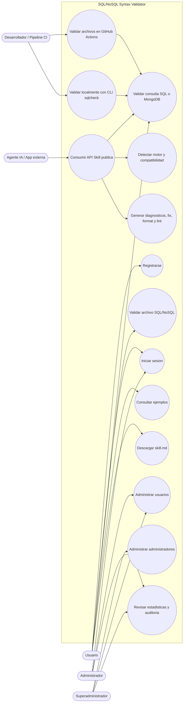

1. Vista Lógica

La vista lógica representa la estructura interna del sistema, mostrando cómo se organizan los componentes para cumplir los requerimientos funcionales.

El sistema sigue el patrón MVC (Modelo-Vista-Controlador).

### Diagrama de Subsistemas (paquetes)

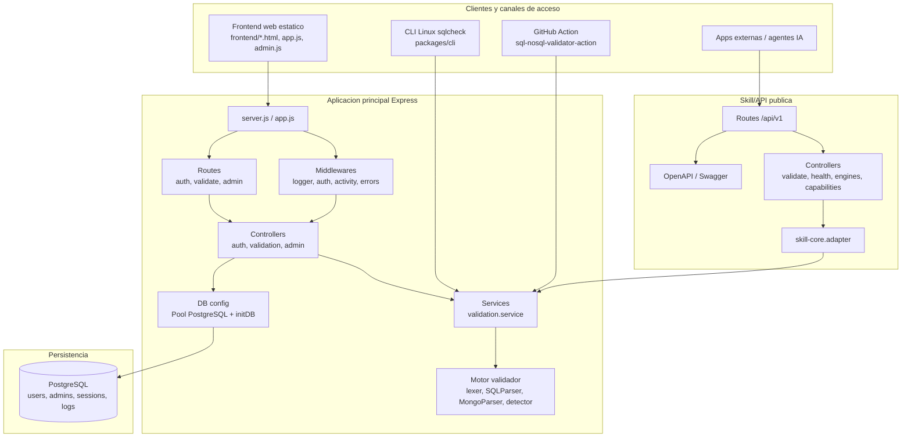

### Diagrama de Secuencia (vista de diseño)

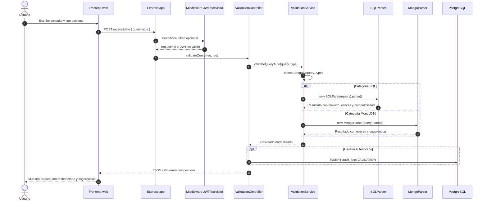

### Diagrama de Colaboración (vista de diseño)

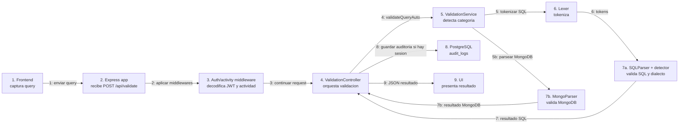

### Diagrama de Objetos

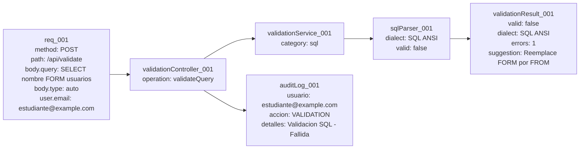

### Diagrama de Clases

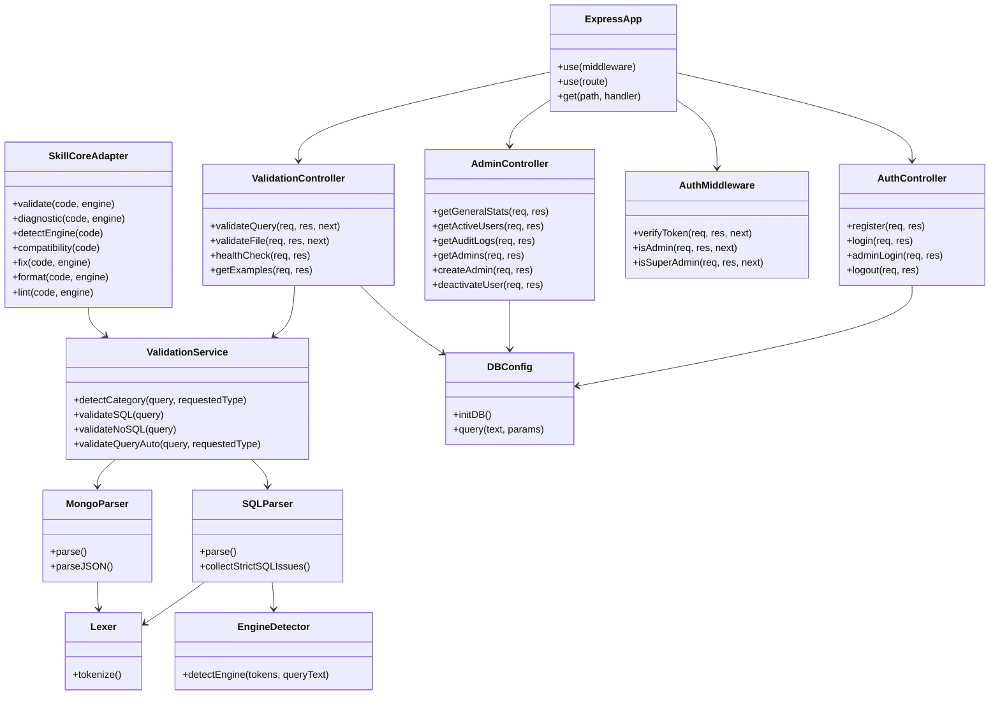

### Diagrama de Base de datos (relacional o no relacional)

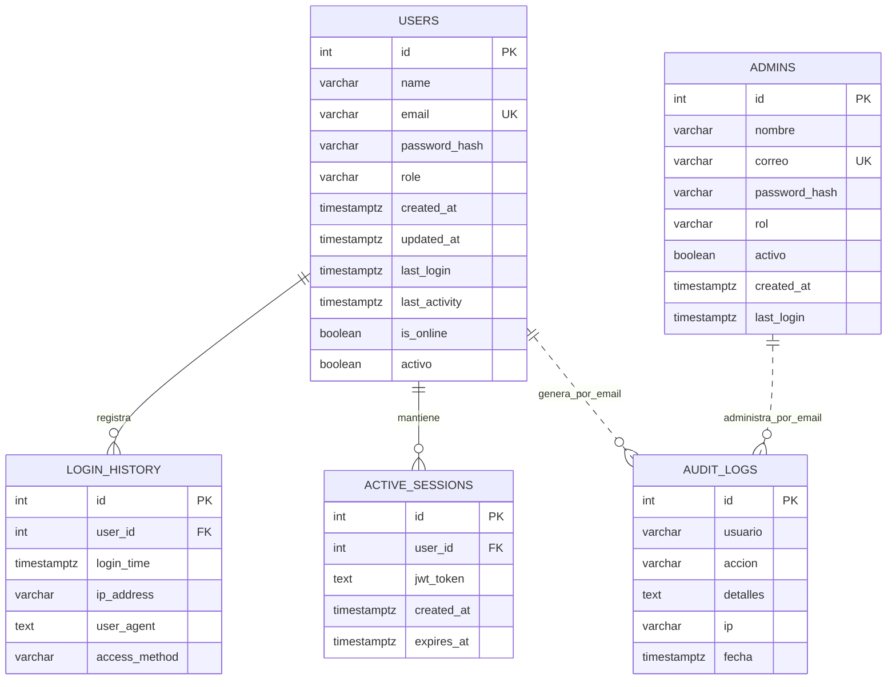

1. Vista de Implementación (vista de desarrollo)

### Diagrama de arquitectura software (paquetes)

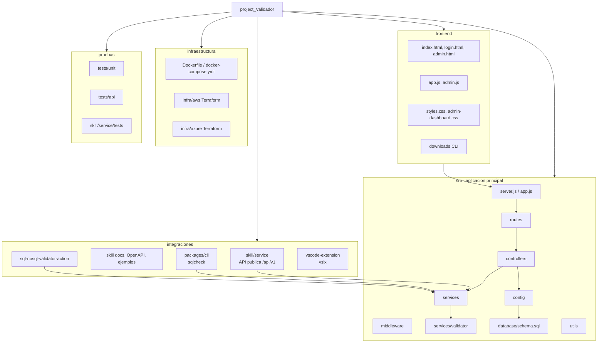

### Diagrama de arquitectura del sistema (Diagrama de componentes)

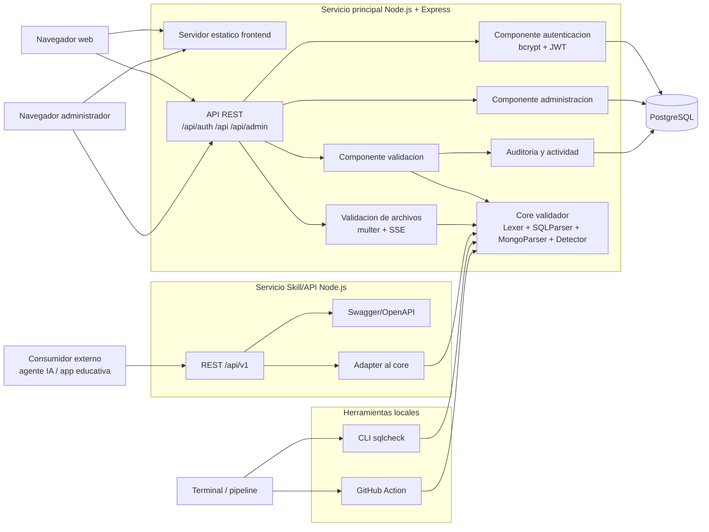

1. Vista de procesos

### Diagrama de Procesos del sistema (diagrama de actividad)

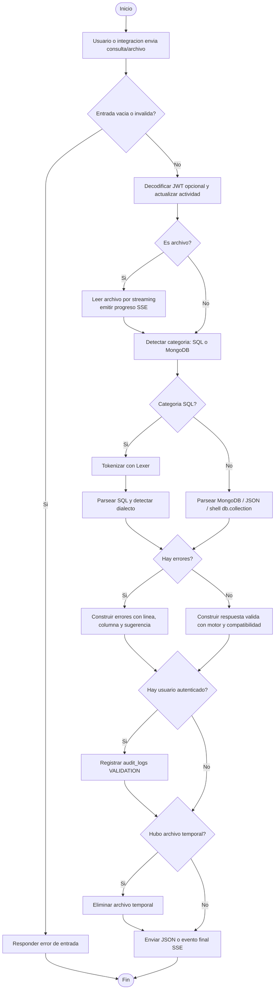

1. Vista de Despliegue (vista física)

### Diagrama de despliegue

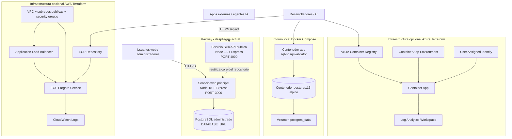

# ATRIBUTOS DE CALIDAD DEL SOFTWARE

Los Atributos de Calidad del Software (Quality Attributes - QAs) son propiedades medibles que permiten evaluar en qué grado un sistema cumple con las necesidades de los usuarios y stakeholders. Estos atributos no describen las funciones del sistema, sino cómo se comporta el sistema al ejecutar dichas funciones, como rendimiento, seguridad o facilidad de uso [Wojcik, 2013].

En el caso del sistema desarrollado, el SQL/NoSQL Syntax Validator, el objetivo principal es validar consultas SQL y MongoDB de manera eficiente, precisa y segura mediante una aplicación web basada en arquitectura MVC.

Escenario de Funcionalidad

La funcionalidad se refiere a la capacidad del sistema para realizar correctamente las tareas para las cuales fue diseñado.

En este proyecto, la funcionalidad se centra en:

- Validación de sintaxis SQL (MySQL, PostgreSQL, SQL).

- Validación de sintaxis MongoDB (consultas tipo JSON y comandos básicos).

- Detección de errores sintácticos en tiempo real.

- Identificación de estructuras inválidas en consultas.

- Retorno de mensajes claros de error o validación correcta.

Escenario:
 Un usuario ingresa una consulta SQL o MongoDB en el editor web. El sistema analiza la estructura de la consulta y determina si es válida o si contiene errores sintácticos, mostrando un mensaje inmediato.

Escenario de Usabilidad

La usabilidad mide qué tan fácil es para el usuario aprender y utilizar el sistema de manera efectiva.

En este sistema, la usabilidad es fundamental porque está orientado a estudiantes y desarrolladores en aprendizaje de bases de datos.

Se considera:

- Interfaz web sencilla basada en editor de código (Monaco Editor).

- Resaltado de sintaxis para SQL y MongoDB.

- Mensajes de error claros y comprensibles.

- Validación en tiempo real sin necesidad de recargar la página.

- Experiencia de uso similar a un entorno de desarrollo.

Escenario:
 Un usuario escribe una consulta MongoDB incorrecta. El sistema inmediatamente resalta el error y muestra un mensaje explicando qué parte de la sintaxis es inválida.

Escenario de confiabilidad

La confiabilidad del sistema se refiere a su capacidad de funcionar correctamente de manera consistente y segura.

En este proyecto incluye:

- Validación segura de entradas para evitar inyección de código.

- Aislamiento del motor de validación respecto a la ejecución real de bases de datos.

- Manejo de errores sin afectar el sistema completo.

- Protección contra entradas mal formadas o maliciosas.

- Control de estabilidad del backend (Node.js + Express).

Dimensiones de seguridad:

- Confidencialidad: no se almacenan datos sensibles del usuario.

- Integridad: las consultas no modifican bases de datos reales.

- Disponibilidad: el sistema permanece operativo ante entradas inválidas.

- Robustez: el sistema no colapsa ante errores de sintaxis.

Escenario:
 Un usuario ingresa una consulta con caracteres maliciosos o incompletos. El sistema la rechaza sin ejecutar ninguna acción peligrosa ni afectar el servidor.

Escenario de rendimiento

El rendimiento evalúa la capacidad del sistema para responder rápidamente a las solicitudes del usuario.

En este sistema se considera:

- Validación en tiempo real de consultas SQL y MongoDB.

- Bajo tiempo de respuesta del backend en Node.js.

- Procesamiento eficiente del análisis sintáctico.

- Manejo de múltiples solicitudes simultáneas.

- Optimización del editor web para escritura fluida.

Escenario:
 Varios usuarios validan consultas al mismo tiempo. El sistema responde en milisegundos sin retrasos perceptibles en la interfaz.

Escenario de mantenibilidad

La mantenibilidad es la facilidad con la que el sistema puede ser modificado, corregido o ampliado.

Este sistema está diseñado con arquitectura MVC (Modelo–Vista–Controlador), lo que permite:

- Separación clara entre frontend y backend.

- Módulos independientes para SQL y MongoDB.

- Facilidad para agregar nuevos tipos de validación en el futuro.

- Código organizado para mantenimiento y depuración.

- Posibilidad de escalar a más lenguajes de consulta.

Escenario:
 Si se desea agregar soporte para otro motor NoSQL, como Cassandra, solo se crea un nuevo módulo de validación sin modificar el núcleo del sistema.

Otros Escenarios

## Escenario de Escalabilidad y Performance

Este atributo evalúa la capacidad del sistema para mantener su rendimiento cuando aumenta la cantidad de usuarios o consultas.

En el proyecto:

- El backend basado en Node.js permite manejo asincrónico de solicitudes.

- El sistema soporta múltiples validaciones simultáneas.

- El frontend mantiene fluidez incluso con varias consultas seguidas.

- Arquitectura preparada para escalar a servicios en la nube.

Escenario:
 El sistema pasa de pocos usuarios a una gran cantidad de usuarios concurrentes. La arquitectura permite mantener tiempos de respuesta estables sin degradación significativa del servicio.
