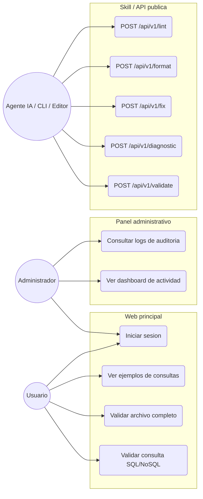
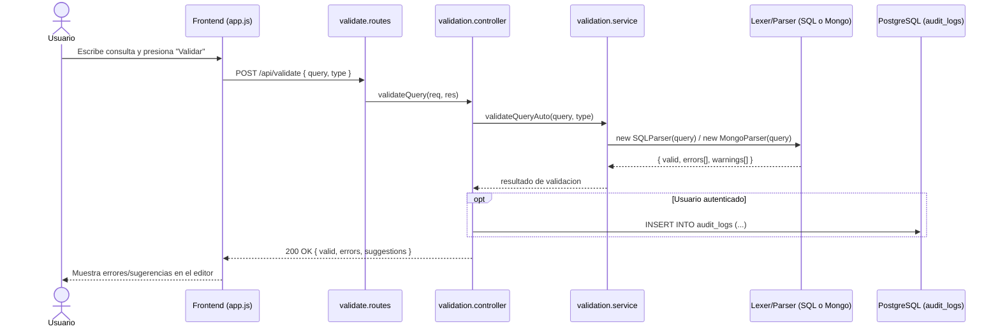
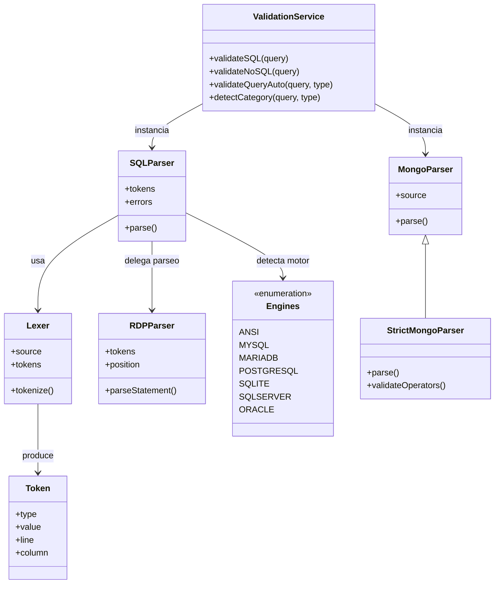
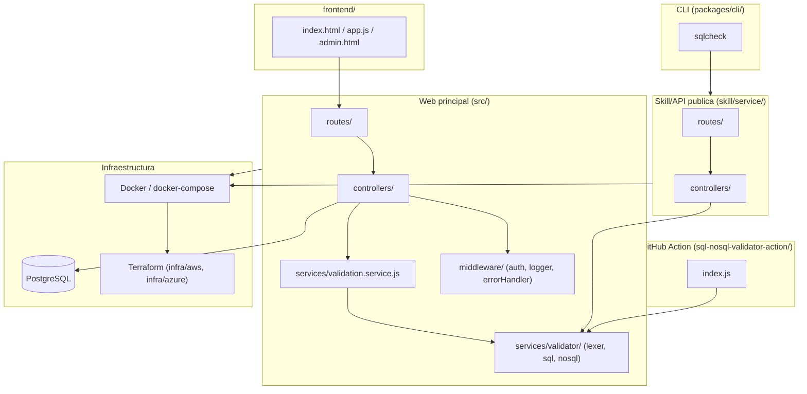
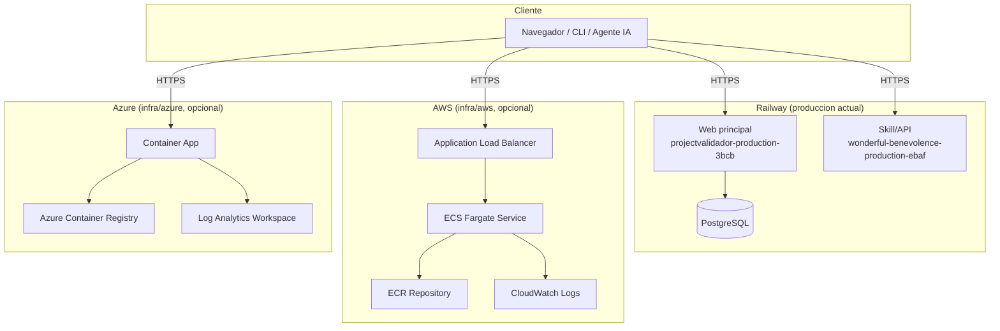
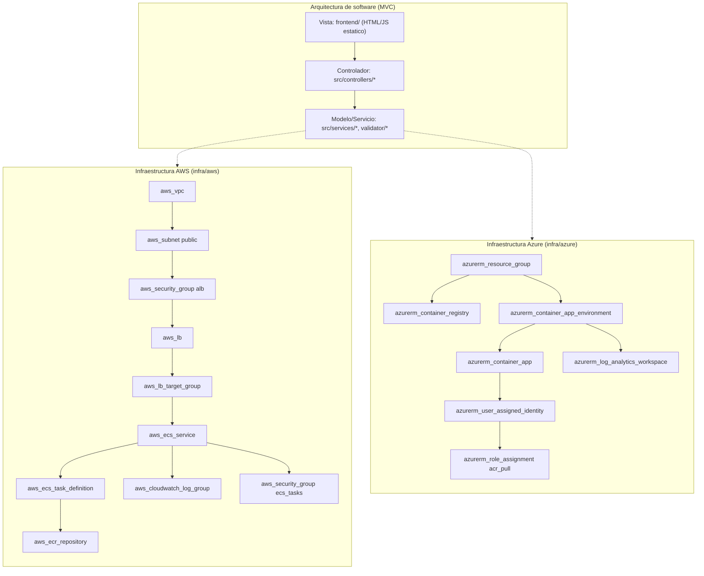

# SQL/NoSQL Syntax Validator

Validador multimotor para consultas SQL y MongoDB. El proyecto incluye una web principal para validar consultas, una Skill/API publica para integraciones externas, un CLI Linux instalable y artefactos de despliegue con Docker y Terraform.

## Enlaces publicos

- Web principal: https://projectvalidador-production-3bcb.up.railway.app
- Skill/API publica: https://wonderful-benevolence-production-ebaf.up.railway.app

## Motores soportados

- SQL ANSI
- MySQL
- MariaDB
- PostgreSQL
- SQL Server
- Oracle
- SQLite
- MongoDB

## Componentes

- Web principal: interfaz estatica servida por Express para escribir, validar y revisar consultas SQL/MongoDB.
- Skill/API publica: servicio REST versionado en `/api/v1` para que agentes IA, apps externas, CLIs y editores consuman el validador sin copiar la gramatica.
- CLI Linux: paquete `sqlcheck` para validar localmente desde terminal, scripts o pipelines.
- Docker/Terraform: Dockerfile y `docker-compose.yml` para ejecucion local; plantillas Terraform en `infra/aws` e `infra/azure` para despliegues cloud.
- Integraciones externas: la API puede conectarse con agentes, apps educativas, apps de auditoria, editores de codigo, bots y validadores previos a ejecucion.

## Diagramas

### Casos de uso



### Diagrama de secuencia (validar una consulta)



### Diagrama de clases (motor de validacion)



### Diagrama de componentes



### Diagrama de despliegue



### Arquitectura de software e infraestructura



## Clonar el proyecto

```bash
git clone <URL_DEL_REPOSITORIO>
cd project_Validador
```

## Ejecutar localmente la web principal

Requisitos:

- Node.js >= 18
- npm

```bash
npm install
npm start
```

Abrir:

```text
http://localhost:3000
```

Modo desarrollo:

```bash
npm run dev
```

Health checks locales:

```bash
curl http://localhost:3000/health
curl http://localhost:3000/api/health
```

## Ejecutar localmente la Skill/API

```bash
cd skill/service
npm install
npm start
```

Abrir:

```text
http://localhost:4000
```

Swagger local:

```text
http://localhost:4000/docs
```

## Usar Docker

Web principal:

```bash
docker build -t sql-nosql-validator .
docker run -p 3000:3000 -e NODE_ENV=development -e PORT=3000 sql-nosql-validator
```

Skill/API:

```bash
cd skill/service
docker build -t sql-validation-skill .
docker run -p 4000:4000 -e PORT=4000 sql-validation-skill
```

Con Docker Compose desde la raiz:

```bash
docker compose up --build
```

## Desplegar

El despliegue actual en Railway se mantiene compatible con `npm start` y el `Dockerfile` de la raiz.

Para infraestructura propia, usar las carpetas Terraform:

```bash
cd infra/aws
cp terraform.tfvars.example terraform.tfvars
terraform init
terraform validate
terraform plan
terraform apply
```

Azure:

```bash
cd infra/azure
cp terraform.tfvars.example terraform.tfvars
terraform init
terraform validate
terraform plan
terraform apply
```

No subir `terraform.tfvars`, `.env`, tokens ni credenciales reales.

## Usar la Skill

La forma principal de uso es consumir la API publica:

```text
https://wonderful-benevolence-production-ebaf.up.railway.app
```

Endpoints principales:

- `GET /health`
- `GET /api/v1/engines`
- `GET /api/v1/capabilities`
- `POST /api/v1/validate`
- `POST /api/v1/diagnostic`
- `POST /api/v1/detect-engine`
- `POST /api/v1/compatibility`
- `POST /api/v1/fix`
- `POST /api/v1/format`
- `POST /api/v1/lint`

Request base para endpoints `POST`:

```json
{
  "engine": "auto",
  "code": "CREATE TABL empleados (id INT);"
}
```

Respuesta de validacion:

```json
{
  "valid": false,
  "engineRequested": "auto",
  "engineDetected": "sql-ansi",
  "errors": [
    {
      "line": 1,
      "column": 8,
      "token": "TABL",
      "message": "TABL no es valido. Se esperaba TABLE.",
      "suggestion": "Reemplace TABL por TABLE.",
      "severity": "error",
      "code": "SQL_SYNTAX_ERROR"
    }
  ],
  "warnings": [],
  "compatibleEngines": ["sql-ansi", "mysql", "mariadb", "postgresql", "sqlite"],
  "analysisTimeMs": 12
}
```

Para agentes IA: leer `skill/skill.md`. Si una aplicacion necesita validar SQL o MongoDB, llamar la API publica y usar el JSON para mostrar errores, advertencias, diagnosticos o sugerencias. No es necesario reimplementar la gramatica ni copiar el validador.

## Probar rapidamente con curl

Health:

```bash
curl https://wonderful-benevolence-production-ebaf.up.railway.app/health
```

Motores:

```bash
curl https://wonderful-benevolence-production-ebaf.up.railway.app/api/v1/engines
```

Validacion:

```bash
curl -X POST https://wonderful-benevolence-production-ebaf.up.railway.app/api/v1/validate \
  -H "Content-Type: application/json" \
  -d '{"engine":"auto","code":"CREATE TABL empleados (id INT);"}'
```

Diagnosticos para editores:

```bash
curl -X POST https://wonderful-benevolence-production-ebaf.up.railway.app/api/v1/diagnostic \
  -H "Content-Type: application/json" \
  -d '{"engine":"auto","code":"SELECT * FORM usuarios;"}'
```

Lint:

```bash
curl -X POST https://wonderful-benevolence-production-ebaf.up.railway.app/api/v1/lint \
  -H "Content-Type: application/json" \
  -d '{"engine":"postgresql","code":"DELETE FROM usuarios;"}'
```

Fix:

```bash
curl -X POST https://wonderful-benevolence-production-ebaf.up.railway.app/api/v1/fix \
  -H "Content-Type: application/json" \
  -d '{"engine":"mysql","code":"CREATE TABL empleados (nombre VARHAR(100));"}'
```

## Documentacion de integracion

- Skill principal para agentes: `skill/skill.md`
- README de la Skill: `skill/README.md`
- Guia de API: `skill/API_INTEGRATION.md`
- Instrucciones para agentes: `skill/AGENT_INSTRUCTIONS.md`
- Casos de uso: `skill/USE_CASES.md`
- Ejemplos: `skill/examples/`

## Variables de entorno

Variables detectadas en la aplicacion principal:

- `PORT`
- `NODE_ENV`
- `DATABASE_URL`
- `DB_HOST`
- `DB_PORT`
- `DB_NAME`
- `DB_USER`
- `DB_PASSWORD`
- `JWT_SECRET`
- `ADMIN_EMAIL`
- `ADMIN_PASSWORD`
- `ADMIN_NAME`

La Skill/API no requiere credenciales por defecto. Usa:

- `PORT`
- `NODE_ENV`
- `CORS_ORIGIN`
- `RATE_LIMIT_WINDOW_MS`
- `RATE_LIMIT_MAX`

## Seguridad

- No incluir secretos ni credenciales en la documentacion.
- No ejecutar automaticamente consultas recibidas de usuarios.
- Validar antes de ejecutar en una base real.
- Tratar `warnings` de `/api/v1/lint` como senales de riesgo operativo.
- Manejar codigos HTTP `400`, `404`, `429` y `500`.
